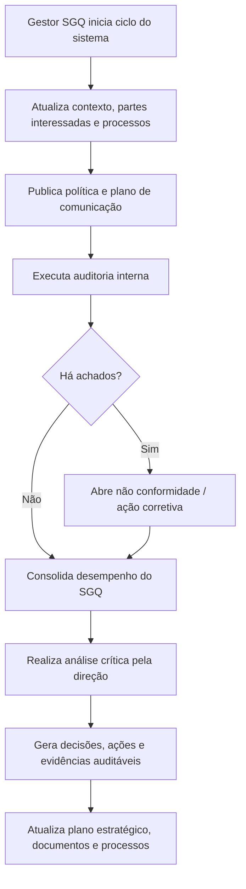

# PRD A: Gestão do Sistema

## 1. Título e objetivo do sprint

**Macro-processo:** A) Gestão do Sistema

**Objetivo do sprint:** consolidar o núcleo SGQ do Daton para que o produto trate contexto organizacional, partes interessadas, escopo e processos do SGQ, política, comunicação, auditorias internas, não conformidades e análise crítica pela direção com trilha auditável.

**Resultado esperado no produto:** o Daton passa a operar como hub de gestão do sistema, conectando planejamento estratégico, documentação, auditoria, CAPA e revisão gerencial em um fluxo único e evidenciável.

**Perguntas da planilha cobertas:** 1 a 12

**Itens ISO cobertos:** 4.1, 4.2, 4.3, 4.4, 5.1, 5.2, 5.3, 6.1, 6.2, 7.4, 7.5, 9.2, 8.7, 10.2, 9.3

## 2. Estado atual do produto

### O que já existe no repositório

- **Planejamento estratégico / governança** com cadastro de plano, SWOT, partes interessadas, objetivos, ações, riscos e oportunidades, revisão e aprovação.
- **Documentação controlada** com versionamento, fluxo de aprovação, distribuição e confirmação de leitura.
- **Estrutura organizacional e permissões** com unidades, departamentos, cargos, usuários e controle de módulos.
- **Notificações internas** para fluxos de documento.

### Telas, fluxos, entidades e APIs já disponíveis

- Telas: `governanca/planejamento`, `governanca/planejamento/:id`, `governanca/riscos-oportunidades`, `qualidade/documentacao`, `organizacao/*`.
- APIs/OpenAPI:
  - planos estratégicos, SWOT, partes interessadas, objetivos, ações e riscos/oportunidades;
  - documentos, versões, anexos, submissão, aprovação, rejeição, distribuição e acknowledge;
  - usuários, unidades, departamentos e cargos.
- Entidades atuais:
  - `strategicPlansTable`
  - `strategicPlanSwotItemsTable`
  - `strategicPlanInterestedPartiesTable`
  - `strategicPlanObjectivesTable`
  - `strategicPlanActionsTable`
  - `strategicPlanRiskOpportunityItemsTable`
  - `documentsTable` e tabelas relacionadas

### O que é parcial, indireto ou insuficiente

- Não existe **módulo dedicado de auditoria interna**.
- Não existe **módulo dedicado de não conformidade e ação corretiva**.
- Não existe **revisão crítica pela direção** como rito próprio com pauta, entradas, saídas e responsáveis.
- O SGQ atual não possui **catálogo formal de processos**, entradas, saídas, sequência, interação e critérios.
- Política e plano de comunicação aparecem apenas como campos textuais ou artefatos indiretos, sem governança própria.

## 3. Gap de conformidade

| Pergunta | Item ISO | Evidência esperada no Daton | Cobertura atual | Observação |
| --- | --- | --- | --- | --- |
| 1 | 4.1 | Plano estratégico com SWOT e ciclo de revisão | implementado | O módulo de governança já mantém plano, SWOT, revisão e frequência de revisão. |
| 2 | 4.2 | Cadastro e monitoramento de partes interessadas | implementado | Já existem partes interessadas, requisitos esperados e método de monitoramento. |
| 3 | 4.3 / 4.4 | Escopo do SGQ, mapa de processos, entradas, saídas e interação | parcial | O plano possui escopo técnico/geográfico, mas não existe catálogo formal de processos do SGQ. |
| 4 | 6.1 | Registro de riscos, oportunidades, respostas e revisão | implementado | O módulo de riscos e oportunidades cobre cadastro, priorização, resposta e eficácia. |
| 5 | 6.2 | Objetivos, metas, responsáveis, prazos e acompanhamento | implementado | Objetivos e ações existem, com responsáveis e datas. |
| 6 | 7.5 | Workflow de informação documentada mantida e retida | implementado | O módulo de documentação cobre criação, revisão, aprovação, distribuição e leitura. |
| 7 | 5.1 / 5.3 | Matriz de responsabilidades e autoridades do SGQ | parcial | Há cargos, usuários e permissões, mas não uma matriz SGQ de papéis e entregas por processo. |
| 8 | 7.4 | Plano de comunicação interna e externa do SGQ | parcial | Existem notificações e distribuição documental, mas não plano de comunicação com canais, periodicidade e responsáveis. |
| 9 | 5.2 | Política de gestão formal, publicada, vigente e evidenciada | parcial | O plano estratégico tem campo de política, mas falta publicação controlada e aceite/ciência. |
| 10 | 9.2 | Programa de auditorias, execução, achados e histórico | não implementado | Não existe módulo de auditoria interna. |
| 11 | 8.7 / 10.2 | Registro de NC, causa, ação corretiva, responsável e verificação | não implementado | Não existe módulo CAPA/NC dedicado. |
| 12 | 9.3 | Análise crítica da direção com entradas, decisões e evidências | parcial | Existe revisão de plano, mas não rito completo de análise crítica do SGQ. |

## 4. Escopo do sprint

### Capacidades a implementar

- Criar **catálogo de processos do SGQ** com:
  - nome do processo;
  - objetivo;
  - entradas;
  - saídas;
  - dono do processo;
  - critérios/indicadores;
  - processos relacionados.
- Criar **módulo de política e comunicação do SGQ** com:
  - política vigente;
  - histórico de versões;
  - canais;
  - públicos;
  - periodicidade;
  - evidência de divulgação.
- Criar **módulo de auditoria interna** com programa, plano, checklist, achados, responsáveis e prazos.
- Criar **módulo de não conformidade e ação corretiva** com abertura, análise de causa, ação, verificação de eficácia e vínculo com auditoria, risco, documento ou processo.
- Criar **módulo de análise crítica pela direção** com entradas obrigatórias, ata, decisões, ações e anexos.
- Integrar esses módulos ao ecossistema atual de governança, documentos, notificações e usuários.

### Integrações e evidências externas

- Evidências de reuniões, apresentações e comunicações já realizadas fora do sistema poderão ser anexadas como registros.
- Auditorias realizadas externamente poderão ser importadas ou cadastradas manualmente.

### Fora do escopo do sprint

- Execução operacional do negócio do cliente.
- BI avançado ou dashboards executivos customizados por cliente.
- Automação de envio por canais externos além de e-mail/notificações já previstas na plataforma.

## 5. User stories

### Story A1

**Como** administrador SGQ, **quero** cadastrar os processos do sistema com entradas, saídas, dono e interações, **para** evidenciar o escopo e a arquitetura do SGQ.

**Critérios de aceitação**

- É possível criar, editar, versionar e inativar processos do SGQ.
- Cada processo exige nome, objetivo, dono, entradas e saídas.
- O sistema permite relacionar processos upstream e downstream.

### Story A2

**Como** gestor SGQ, **quero** publicar a política vigente e controlar sua divulgação, **para** comprovar comunicação e alinhamento do sistema.

**Critérios de aceitação**

- A política possui versão, vigência, aprovador e histórico.
- É possível distribuir a política para públicos internos definidos.
- O sistema registra ciência/leitura quando aplicável.

### Story A3

**Como** auditor interno, **quero** programar e executar auditorias com achados vinculados a processos e requisitos ISO, **para** manter o programa auditável.

**Critérios de aceitação**

- Cada auditoria possui escopo, critérios, período, auditor e status.
- O sistema registra constatações classificadas por conformidade, observação e não conformidade.
- Cada achado pode gerar ação corretiva.

### Story A4

**Como** responsável por processo, **quero** tratar não conformidades com causa raiz e ação corretiva, **para** demonstrar controle e melhoria.

**Critérios de aceitação**

- A NC possui origem, descrição, classificação, causa e responsável.
- O plano de ação possui prazo, evidência de execução e status.
- Existe etapa de verificação de eficácia antes do encerramento.

### Story A5

**Como** direção da organização, **quero** registrar análises críticas formais do SGQ, **para** consolidar decisões, recursos e prioridades.

**Critérios de aceitação**

- A análise crítica exige entradas mínimas configuráveis.
- A ata registra decisões, responsáveis e prazos.
- A reunião pode gerar ações vinculadas ao plano, ao processo ou a uma NC.

## 6. Fluxo principal

## 7. Dados, permissões e integrações

### Entidades necessárias

- `sgq_processes`
- `sgq_process_interactions`
- `sgq_policies`
- `sgq_communication_plans`
- `internal_audits`
- `internal_audit_findings`
- `nonconformities`
- `corrective_actions`
- `management_reviews`
- `management_review_inputs`
- `management_review_outputs`

### Regras de acesso

- `org_admin`: cria, aprova, configura e fecha registros de todos os módulos do macro-processo.
- `analyst`: cadastra processos, prepara auditorias, abre NCs, registra revisões e acompanha ações.
- `operator`: consulta artefatos publicados e responde ações quando designado.

### Integrações presumidas

- Documentos já existentes devem ser vinculáveis como evidência.
- Notificações devem ser reaproveitadas para tarefas, aprovações e prazos.
- Arquivos externos devem subir pelo fluxo de storage existente.

## 8. Critérios de pronto

- O Daton possui um catálogo auditável de processos do SGQ com entradas, saídas e interação.
- O Daton possui política vigente com fluxo de publicação e evidência de divulgação.
- O Daton possui programa de auditoria interna e histórico de execuções.
- O Daton possui gestão formal de não conformidades e ações corretivas.
- O Daton possui análise crítica pela direção com entradas, decisões e saídas rastreáveis.
- Todos os registros podem gerar trilha temporal, responsável, anexos e vínculo com requisito ISO.

