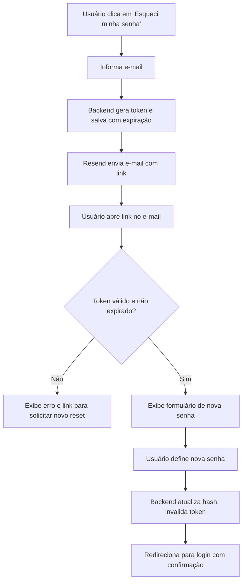

# PRD Auth: Recuperação de Senha

## 1. Título e objetivo

**Funcionalidade:** Recuperação de senha ("esqueci minha senha")

**Objetivo:** permitir que um usuário que perdeu ou esqueceu sua senha redefina-a de forma segura sem depender de um administrador, via link enviado por e-mail com token de uso único e prazo de expiração.

**Resultado esperado no produto:** o fluxo de login passa a ter o link "Esqueci minha senha". O usuário informa o e-mail, recebe um link por e-mail, clica e define uma nova senha. O acesso é restabelecido sem intervenção manual.

## 2. Estado atual do produto

### O que já existe no repositório

- Tela de autenticação: `artifacts/web/src/pages/auth.tsx` com login e cadastro de organização.
- API de autenticação: `artifacts/api-server/src/routes/auth.ts` com `/auth/login`, `/auth/register`, `/auth/logout`, `/auth/me` e `/auth/me/password`.
- Troca de senha autenticada: `PATCH /auth/me/password` exige senha atual — não serve para usuários que não sabem a senha.
- Serviço de e-mail: Resend configurado via `RESEND_API_KEY` / `RESEND_FROM_EMAIL`.
- Schema de usuários: `lib/db/src/schema/users.ts` — sem tabela de tokens de reset.

### O que é parcial, indireto ou insuficiente

- Não há link "Esqueci minha senha" na tela de login.
- Não há endpoint de solicitação de reset nem de confirmação.
- Não há tabela `password_reset_tokens` no banco.
- Não há e-mail transacional de recuperação de senha.

## 3. Escopo

### Capacidades a implementar

- **Solicitar reset:** formulário de e-mail acessível pela tela de login; backend envia e-mail com link contendo token seguro.
- **Confirmar reset:** página acessível pelo link do e-mail; usuário define nova senha; token é invalidado imediatamente após uso.
- **Segurança do token:** token aleatório (UUID v4 ou crypto.randomBytes), expiração de 1 hora, uso único (soft-delete após consumo), sem revelar se o e-mail existe (resposta genérica ao solicitante).

### Fora do escopo

- Reset por SMS ou autenticação multifator.
- Fluxo de desbloqueio de conta por tentativas excessivas.
- Painel administrativo para revogar tokens em aberto.

## 4. User stories

### Story R1

**Como** usuário que não lembra sua senha, **quero** solicitar um link de redefinição informando meu e-mail, **para** receber instruções sem depender de suporte manual.

**Critérios de aceitação**

- O link "Esqueci minha senha" aparece na tela de login abaixo do campo de senha.
- O formulário aceita apenas um campo: e-mail.
- Ao submeter, o backend gera o token, persiste com expiração de 1 hora e dispara o e-mail via Resend.
- A resposta da API é sempre genérica ("Se o e-mail estiver cadastrado, você receberá um link em breve") independentemente de o e-mail existir ou não.
- O e-mail contém link direto para a página de redefinição com o token na URL.

### Story R2

**Como** usuário que recebeu o link de redefinição, **quero** definir uma nova senha, **para** recuperar o acesso à minha conta.

**Critérios de aceitação**

- A página de redefinição lê o token da URL e valida com o backend antes de exibir o formulário.
- Se o token for inválido ou expirado, exibe mensagem de erro e link para solicitar novo reset.
- O formulário exige nova senha (mín. 6 caracteres) e confirmação.
- Ao salvar, o backend: valida o token, atualiza o `passwordHash`, marca o token como usado, invalida qualquer outro token pendente do mesmo usuário.
- Após sucesso, redireciona para a tela de login com mensagem de confirmação.

## 5. Fluxo principal

## 6. Dados e entidades

### Nova tabela

`password_reset_tokens`

| Coluna | Tipo | Descrição |
| --- | --- | --- |
| `id` | serial PK | — |
| `userId` | integer FK → users | dono do token |
| `token` | text unique | valor opaco gerado no servidor |
| `expiresAt` | timestamp tz | `now() + 1 hora` |
| `usedAt` | timestamp tz nullable | preenchido ao consumir |
| `createdAt` | timestamp tz | — |

### Novos endpoints

| Método | Path | Descrição |
| --- | --- | --- |
| `POST` | `/auth/password-reset/request` | gera token e envia e-mail |
| `POST` | `/auth/password-reset/confirm` | valida token e redefine senha |
| `GET` | `/auth/password-reset/validate/:token` | verifica se token é válido (usado pelo frontend antes de exibir o form) |

### Novas rotas frontend

| Path | Descrição |
| --- | --- |
| `/auth/esqueci-minha-senha` | formulário de solicitação |
| `/auth/redefinir-senha?token=…` | formulário de redefinição |

## 7. Critérios de pronto

- O fluxo completo funciona end-to-end em staging: solicitar → receber e-mail → redefinir → logar.
- Token expirado retorna erro adequado na UI.
- Token já usado retorna erro adequado na UI.
- A resposta de solicitação não revela se o e-mail existe no sistema.
- `pnpm typecheck` passa sem erros.
