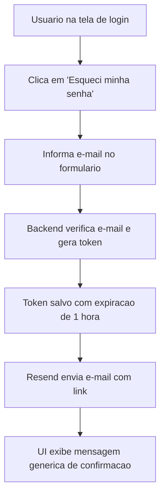

## Resultado de negocio

O usuario que perdeu a senha precisa recuperar o acesso de forma autonoma, sem depender de suporte ou administrador da organizacao.

## Caso de uso na plataforma

O usuario clica em "Esqueci minha senha" na tela de login, informa o e-mail e recebe um link de redefinicao por e-mail.

## Fluxo esperado

1. o usuario clica no link "Esqueci minha senha" na tela de login
2. informa o endereco de e-mail cadastrado
3. o backend gera um token unico com expiracao de 1 hora e persiste na tabela `password_reset_tokens`
4. o Resend dispara o e-mail com o link de redefinicao
5. a UI exibe mensagem generica independentemente de o e-mail existir ou nao

## Requisitos tecnicos essenciais

- criar tabela `password_reset_tokens` com `userId`, `token`, `expiresAt`, `usedAt`
- criar endpoint `POST /auth/password-reset/request` com resposta generica
- integrar envio de e-mail via Resend com template do link
- adicionar link "Esqueci minha senha" na tela `auth.tsx` e pagina `/auth/esqueci-minha-senha`
- adicionar endpoints e schemas no OpenAPI e regenerar clientes

## Criterios de pronto

- o link aparece na tela de login
- ao submeter o formulario com e-mail valido, o e-mail chega via Resend
- ao submeter com e-mail inexistente, a resposta e identica (sem revelacao)
- o token fica gravado no banco com expiracao correta

## Rastreabilidade

- PRD: Auth - Recuperacao de Senha
- Story de referencia: R1
- Caminho do PRD: `docs/prds/auth-recuperacao-de-senha/PRD.md`
- Situacao auditada: Nao implementado.
- Milestone: Auth · Recuperação de Senha

## Diagrama do fluxo

