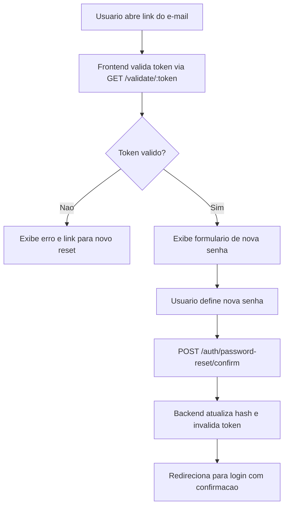

## Resultado de negocio

O usuario que recebeu o link por e-mail precisa conseguir definir uma nova senha e recuperar o acesso imediatamente.

## Caso de uso na plataforma

O usuario abre o link do e-mail, o frontend valida o token, exibe o formulario de nova senha, e o backend redefine o hash e invalida o token.

## Fluxo esperado

1. o usuario abre o link `/auth/redefinir-senha?token=...`
2. o frontend chama `GET /auth/password-reset/validate/:token` para verificar validade antes de exibir o form
3. se invalido ou expirado, exibe mensagem de erro com link para solicitar novo reset
4. se valido, exibe formulario com campos de nova senha e confirmacao
5. ao submeter, o frontend chama `POST /auth/password-reset/confirm` com token e nova senha
6. o backend valida o token, atualiza o `passwordHash`, marca `usedAt` e invalida outros tokens pendentes do mesmo usuario
7. o frontend redireciona para `/auth` com mensagem de sucesso

## Requisitos tecnicos essenciais

- criar endpoint `GET /auth/password-reset/validate/:token` — retorna 200 ou 400
- criar endpoint `POST /auth/password-reset/confirm` — valida token, atualiza senha, invalida token
- criar pagina `/auth/redefinir-senha` no frontend com leitura do token via query param
- tratar estados: token valido, token expirado, token ja usado
- apos sucesso, redirecionar para login com mensagem via `sessionStorage` (padrao existente em auth.tsx)

## Criterios de pronto

- token valido exibe formulario de nova senha
- token expirado ou ja usado exibe erro claro com acao de recuperacao
- apos redefinicao bem-sucedida, o usuario consegue logar com a nova senha
- o token nao pode ser reaproveitado apos uso

## Rastreabilidade

- PRD: Auth - Recuperacao de Senha
- Story de referencia: R2
- Caminho do PRD: `docs/prds/auth-recuperacao-de-senha/PRD.md`
- Situacao auditada: Nao implementado.
- Milestone: Auth · Recuperação de Senha

## Diagrama do fluxo

