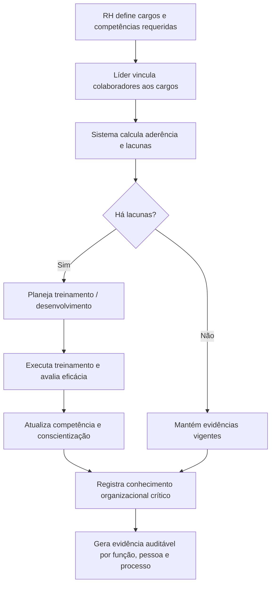

# PRD B: Recursos Humanos

## 1. Título e objetivo do sprint

**Macro-processo:** B) Recursos Humanos

**Objetivo do sprint:** transformar o módulo atual de colaboradores em um núcleo de competência, treinamento, conscientização e conhecimento organizacional auditável.

**Resultado esperado no produto:** o Daton passa a demonstrar, por função e por colaborador, competências requeridas, competências atendidas, ações de desenvolvimento, eficácia e registros de conscientização.

**Perguntas da planilha cobertas:** 13 a 17

**Itens ISO cobertos:** 7.2.a, 7.2.b, 7.2.c, 7.3, 7.1.6

## 2. Estado atual do produto

### O que já existe no repositório

- Cadastro de colaboradores com vínculo organizacional.
- Cadastro de cargos, departamentos e unidades.
- Registros de competências, treinamentos e conscientização por colaborador.
- Itens de perfil com anexos para experiências e certificações.

### Telas, fluxos, entidades e APIs já disponíveis

- Telas: `qualidade/colaboradores`, `organizacao/colaboradores`, `organizacao/cargos`, `organizacao/departamentos`, `organizacao/unidades`.
- APIs/OpenAPI:
  - `List employees`, `Create employee`, `Get employee with competencies, trainings, awareness`;
  - `List/Create/Update/Delete competency`;
  - `List/Create/Update/Delete training`;
  - `List/Create/Update/Delete awareness record`.
- Entidades atuais:
  - `employeesTable`
  - `employeeCompetenciesTable`
  - `employeeTrainingsTable`
  - `employeeAwarenessTable`
  - `employeeProfileItemsTable`
  - `positionsTable`

### O que é parcial, indireto ou insuficiente

- A competência está modelada por colaborador, mas não existe **matriz formal por cargo/função**.
- Não existe visão de **lacuna entre competência requerida e adquirida** por função e por unidade.
- Treinamento possui status e anexos, mas não uma **etapa explícita de avaliação de eficácia**.
- Conhecimento organizacional não existe como repositório estruturado por processo/função; hoje está disperso em documentos, perfil e base de conhecimento.

## 3. Gap de conformidade

| Pergunta | Item ISO | Evidência esperada no Daton | Cobertura atual | Observação |
| --- | --- | --- | --- | --- |
| 13 | 7.2.a | Competências requeridas por função/cargo | parcial | Existem competências por colaborador, mas não uma matriz corporativa por cargo. |
| 14 | 7.2.b | Comprovação de aderência da pessoa às competências requeridas | parcial | Há registros individuais, porém sem consolidação automática de aderência. |
| 15 | 7.2.c | Plano para adquirir competência e avaliação de eficácia | parcial | Treinamentos existem, mas a eficácia não é tratada como etapa própria. |
| 16 | 7.3 | Registros de conscientização sobre política, objetivos e impacto | implementado | O módulo de awareness já registra tema, método de verificação, data e resultado. |
| 17 | 7.1.6 | Mapeamento e controle do conhecimento organizacional | parcial | Há documentos e perfis, porém não um repositório estruturado de conhecimento por processo/função. |

## 4. Escopo do sprint

### Capacidades a implementar

- Criar **matriz de competência por cargo/função**.
- Criar **painel de aderência** entre competência exigida e competência evidenciada.
- Evoluir treinamentos para suportar:
  - objetivo do treinamento;
  - competência impactada;
  - avaliação de eficácia;
  - vencimento e renovação.
- Evoluir conscientização para vincular:
  - política;
  - objetivo;
  - documento;
  - processo.
- Criar **registro de conhecimento organizacional** com:
  - conhecimento crítico;
  - processo relacionado;
  - risco de perda;
  - forma de retenção;
  - evidência.

### Integrações e evidências externas

- Certificados, listas de presença, avaliações e evidências externas podem ser anexados aos registros.
- Caso treinamentos sejam geridos por LMS externo, o Daton deverá aceitar importação manual ou integração posterior.

### Fora do escopo do sprint

- Folha de pagamento.
- Gestão completa de recrutamento e seleção.
- Ponto eletrônico e benefícios.

## 5. User stories

### Story B1

**Como** gestor de RH/SGQ, **quero** definir competências mínimas por cargo, **para** ter referência única de conformidade por função.

**Critérios de aceitação**

- Cada cargo aceita competências obrigatórias e nível requerido.
- A matriz pode ser filtrada por unidade, departamento e cargo.
- A matriz fica auditável por versão e data de atualização.

### Story B2

**Como** líder de área, **quero** ver as lacunas de competência do meu time, **para** priorizar capacitação e cobertura de risco.

**Critérios de aceitação**

- O sistema mostra aderência por colaborador e por competência.
- Lacunas vencidas ou críticas ficam destacadas.
- É possível exportar ou anexar evidências de regularização.

### Story B3

**Como** analista de treinamento, **quero** registrar eficácia do treinamento, **para** comprovar que a ação realmente desenvolveu a competência esperada.

**Critérios de aceitação**

- Todo treinamento pode registrar método de avaliação.
- O resultado de eficácia fica salvo no histórico do colaborador.
- O treinamento pode atualizar o nível adquirido de competência quando aprovado.

### Story B4

**Como** gestor SGQ, **quero** ligar conscientização a políticas, objetivos e documentos, **para** demonstrar alinhamento com o sistema de gestão.

**Critérios de aceitação**

- O registro de conscientização aceita vínculo com política, documento e processo.
- O sistema diferencia treinamento de conscientização.
- É possível comprovar participação e resultado da verificação.

### Story B5

**Como** dono de processo, **quero** registrar conhecimento organizacional crítico, **para** reduzir perda de know-how.

**Critérios de aceitação**

- O conhecimento pode ser vinculado a processo, função, documento e risco.
- O sistema registra mecanismo de retenção e sucessão.
- Conhecimentos críticos sem evidência vigente ficam sinalizados.

## 6. Fluxo principal

## 7. Dados, permissões e integrações

### Entidades necessárias

- `position_competency_requirements`
- `employee_competency_gaps`
- `training_effectiveness_reviews`
- `knowledge_assets`
- `knowledge_asset_links`

### Regras de acesso

- `org_admin`: configura cargos, regras, matrizes e evidências críticas.
- `analyst`: gerencia colaboradores, competências, treinamentos e conscientização.
- `operator`: consulta seu histórico e responde ações ou ciência quando permitido.

### Integrações presumidas

- Reaproveitar anexos e storage já existentes.
- Permitir importação futura de LMS/RHIS, sem depender disso no v1.

## 8. Critérios de pronto

- Existe matriz de competência por cargo/função.
- O sistema calcula e evidencia lacunas por colaborador e por equipe.
- Treinamentos possuem registro de eficácia.
- Conscientização pode ser vinculada a política, objetivos e documentos.
- Conhecimento organizacional crítico pode ser registrado, mantido e auditado.
- O módulo gera trilha de evidência suficiente para responder às perguntas 13 a 17.

