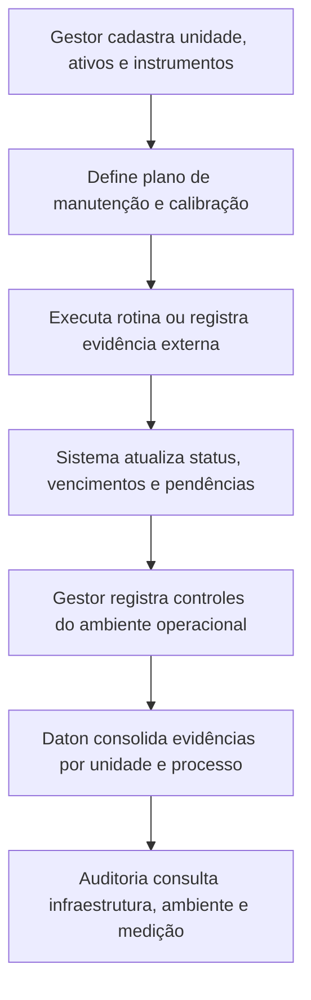

# PRD C: Gestão de Infraestrutura / Manutenção

## 1. Título e objetivo do sprint

**Macro-processo:** C) Gestão de Infraestrutura / Manutenção

**Objetivo do sprint:** criar a camada SGI de controle de infraestrutura, ambiente operacional e recursos de medição, sem transformar o Daton em um CMMS completo.

**Resultado esperado no produto:** o Daton passa a registrar ativos críticos, planos de manutenção, controles ambientais e controles de calibração/monitoramento como evidência formal do SGQ.

**Perguntas da planilha cobertas:** 18 a 20

**Itens ISO cobertos:** 7.1.3, 7.1.4, 7.1.5

## 2. Estado atual do produto

### O que já existe no repositório

- Cadastro de unidades organizacionais.
- Documentação controlada para manter procedimentos e instruções.
- Legislações, questionários e tags de compliance por unidade.

### Telas, fluxos, entidades e APIs já disponíveis

- Telas: `organizacao/unidades`, `qualidade/documentacao`, `qualidade/legislacoes`, questionário por unidade.
- APIs/OpenAPI:
  - unidades;
  - documentações;
  - legislações e compliance tags por unidade;
  - questionários por unidade.

### O que é parcial, indireto ou insuficiente

- Não há cadastro de ativos, equipamentos ou infraestrutura crítica.
- Não há plano de manutenção preventiva/corretiva.
- Não há registro estruturado de ambiente operacional.
- Não há controle de instrumentos, calibração, validade e salvaguarda.

## 3. Gap de conformidade

| Pergunta | Item ISO | Evidência esperada no Daton | Cobertura atual | Observação |
| --- | --- | --- | --- | --- |
| 18 | 7.1.3 | Cadastro de infraestrutura crítica e controles associados | parcial | Existem unidades e documentos, mas não um módulo de infraestrutura/ativos. |
| 19 | 7.1.4 | Registro das condições de ambiente de trabalho e seus controles | não implementado | Não existe módulo para ambiente físico, social e psicológico. |
| 20 | 7.1.5 | Inventário de instrumentos, calibração, identificação e status | não implementado | Não existe gestão de recursos de medição e monitoramento. |

## 4. Escopo do sprint

### Capacidades a implementar

- Criar **cadastro de ativos e infraestrutura crítica** por unidade.
- Criar **plano de controle/manutenção** por ativo:
  - preventiva;
  - corretiva;
  - checklist;
  - periodicidade;
  - evidência.
- Criar **registro de ambiente operacional** por unidade/processo:
  - fatores físicos;
  - fatores sociais;
  - fatores psicológicos;
  - ações associadas.
- Criar **cadastro de instrumentos e recursos de medição** com:
  - identificação;
  - faixa de uso;
  - periodicidade de calibração/verificação;
  - certificado anexo;
  - status.

### Integrações e evidências externas

- O Daton não será o sistema de manutenção em campo por padrão.
- Execuções feitas em software externo ou planilhas poderão ser anexadas/importadas como evidência.
- Certificados de calibração poderão ser anexados via storage existente.

### Fora do escopo do sprint

- Ordem de serviço completa de manutenção com peças, custos e estoque.
- Telemetria IoT ou integração nativa com instrumentação industrial.

## 5. User stories

### Story C1

**Como** gestor de infraestrutura, **quero** cadastrar ativos críticos por unidade, **para** identificar o que impacta a conformidade de produtos e serviços.

**Critérios de aceitação**

- O ativo possui tipo, localização, processo impactado e criticidade.
- O ativo pode ser vinculado a documentos e instruções.
- O cadastro registra responsável e status.

### Story C2

**Como** responsável de manutenção, **quero** registrar planos e execuções de manutenção, **para** comprovar disponibilidade e controle da infraestrutura.

**Critérios de aceitação**

- O plano possui periodicidade, checklist e responsável.
- É possível anexar evidências de execução.
- O sistema alerta itens vencidos ou sem evidência.

### Story C3

**Como** gestor SGQ, **quero** registrar controles do ambiente operacional, **para** demonstrar que as condições de trabalho são adequadas aos processos.

**Critérios de aceitação**

- O registro aceita fator físico, social ou psicológico.
- Cada controle possui responsável, frequência e evidência.
- Riscos sem ação associada ficam destacados.

### Story C4

**Como** responsável por instrumentos, **quero** controlar calibração e verificação, **para** manter a validade dos resultados de monitoramento e medição.

**Critérios de aceitação**

- O instrumento possui identificação única e status.
- O sistema controla vencimento de calibração/verificação.
- Certificados e histórico ficam anexados ao instrumento.

## 6. Fluxo principal

## 7. Dados, permissões e integrações

### Entidades necessárias

- `assets`
- `asset_maintenance_plans`
- `asset_maintenance_records`
- `work_environment_controls`
- `measurement_resources`
- `measurement_resource_calibrations`

### Regras de acesso

- `org_admin`: configura cadastros mestre e acesso global.
- `analyst`: mantém registros, planos, evidências e vencimentos.
- `operator`: registra execução de checklist quando designado.

### Integrações presumidas

- Anexos de certificados, fotos e laudos via fluxo de documentos/storage.
- Importação manual de OS ou calibração gerada externamente.

## 8. Critérios de pronto

- O Daton possui inventário de ativos críticos e recursos de medição.
- O Daton registra planos e evidências de manutenção.
- O Daton registra controles de ambiente operacional.
- O Daton alerta itens vencidos e sem evidência.
- O módulo responde às perguntas 18 a 20 com trilha auditável.

