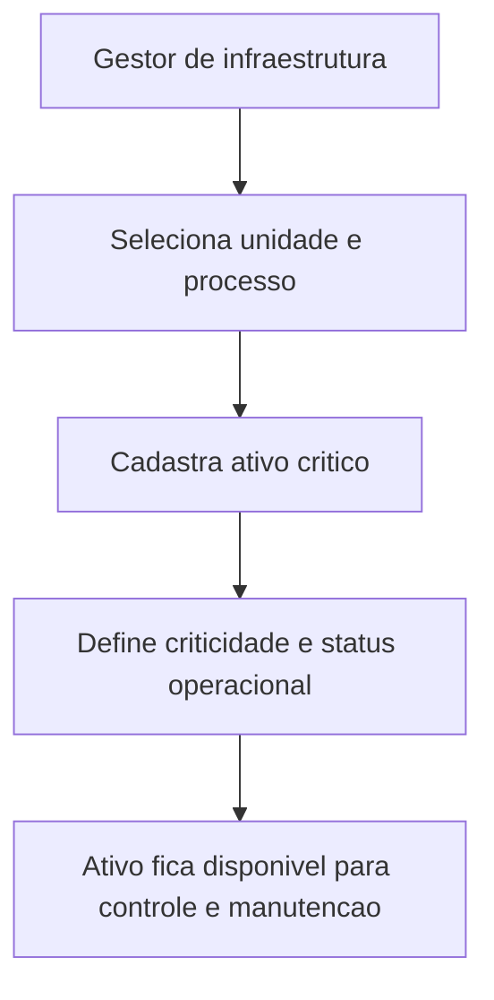

## Resultado de negocio

O Daton precisa identificar os ativos que mais impactam a conformidade de produtos e servicos, permitindo leitura por unidade e processo.

## Caso de uso na plataforma

O gestor cadastra ativos criticos, define seu contexto operacional e usa essa base para manutencao, risco e disponibilidade.

## Fluxo esperado

1. o usuario escolhe a unidade e o processo impactado
2. cadastra o ativo e sua criticidade
3. o status operacional passa a ser acompanhado
4. o ativo fica disponivel para manutencao e leitura auditavel

## Requisitos tecnicos essenciais

- manter cadastro de ativos por unidade e processo
- registrar criticidade, responsavel e status operacional
- preservar vinculo com futuras execucoes de manutencao

## Criterios de pronto

- ativos criticos podem ser consultados por unidade
- a criticidade e o impacto no processo ficam visiveis
- a base suporta planejamento de manutencao posterior

## Rastreabilidade

- PRD: C
- Story de referencia: C1
- Caminho do PRD: `docs/prds/c-gestao-de-infraestrutura-manutencao/gestao-de-infraestrutura-manutencao.md`
- Itens do Excel/ISO: Item 18 / clausula 7.1.3
- Situacao auditada: Parcial.
- Milestone: PRD C · Gestão de Infraestrutura / Manutenção

## Diagrama do fluxo

