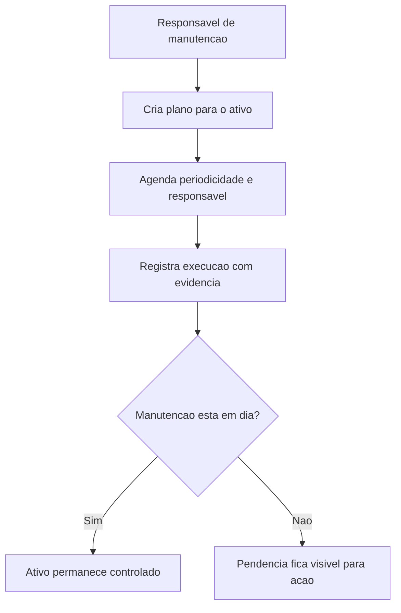

## Resultado de negocio

O Daton precisa demonstrar como a organizacao planeja e executa manutencoes que sustentam disponibilidade e conformidade da infraestrutura.

## Caso de uso na plataforma

O responsavel registra manutencoes preventivas ou corretivas, acompanha execucao e preserva evidencias do que foi feito.

## Fluxo esperado

1. o usuario cria um plano de manutencao para o ativo
2. define periodicidade, responsavel e proxima execucao
3. cada execucao gera evidencia e historico
4. a organizacao passa a comprovar disponibilidade e cuidado com a infraestrutura

## Requisitos tecnicos essenciais

- manter planos preventivos e corretivos por ativo
- registrar execucoes com data, responsavel e evidencia
- permitir leitura de historico e proximos vencimentos

## Criterios de pronto

- cada ativo pode ter manutencoes planejadas e executadas
- o historico e consultavel por ativo e periodo
- as manutencoes vencidas ou pendentes ficam visiveis

## Rastreabilidade

- PRD: C
- Story de referencia: C2
- Caminho do PRD: `docs/prds/c-gestao-de-infraestrutura-manutencao/gestao-de-infraestrutura-manutencao.md`
- Itens do Excel/ISO: Item 18 / clausula 7.1.3
- Situacao auditada: Planejado como desdobramento obrigatorio do item 18.
- Milestone: PRD C · Gestão de Infraestrutura / Manutenção

## Diagrama do fluxo

