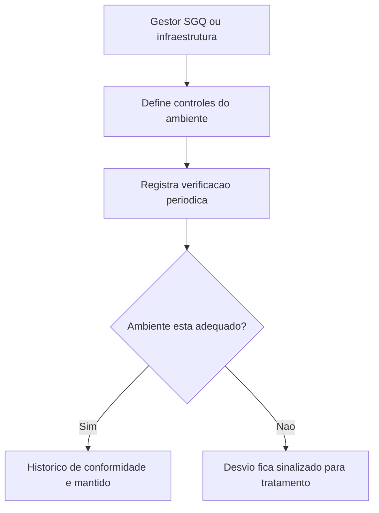

## Resultado de negocio

O Daton precisa evidenciar se o ambiente fisico, social e psicologico de trabalho permanece adequado aos processos que a organizacao executa.

## Caso de uso na plataforma

O gestor registra controles e verificacoes do ambiente operacional por unidade, com periodicidade e leitura historica.

## Fluxo esperado

1. o usuario define o que precisa ser observado no ambiente
2. registra verificacoes periodicas e evidencias
3. eventuais desvios ficam visiveis para tratamento
4. a organizacao passa a demonstrar adequacao do ambiente de trabalho

## Requisitos tecnicos essenciais

- manter controles periodicos do ambiente operacional
- registrar criterios, responsavel e evidencia
- permitir historico por unidade e tipo de controle

## Criterios de pronto

- o ambiente operacional pode ser acompanhado com registros periodicos
- desvios geram visibilidade e possibilidade de acao
- o historico sustenta leitura auditavel do item 19

## Rastreabilidade

- PRD: C
- Story de referencia: C3
- Caminho do PRD: `docs/prds/c-gestao-de-infraestrutura-manutencao/gestao-de-infraestrutura-manutencao.md`
- Itens do Excel/ISO: Item 19 / clausula 7.1.4
- Situacao auditada: Planejado.
- Milestone: PRD C · Gestão de Infraestrutura / Manutenção

## Diagrama do fluxo

