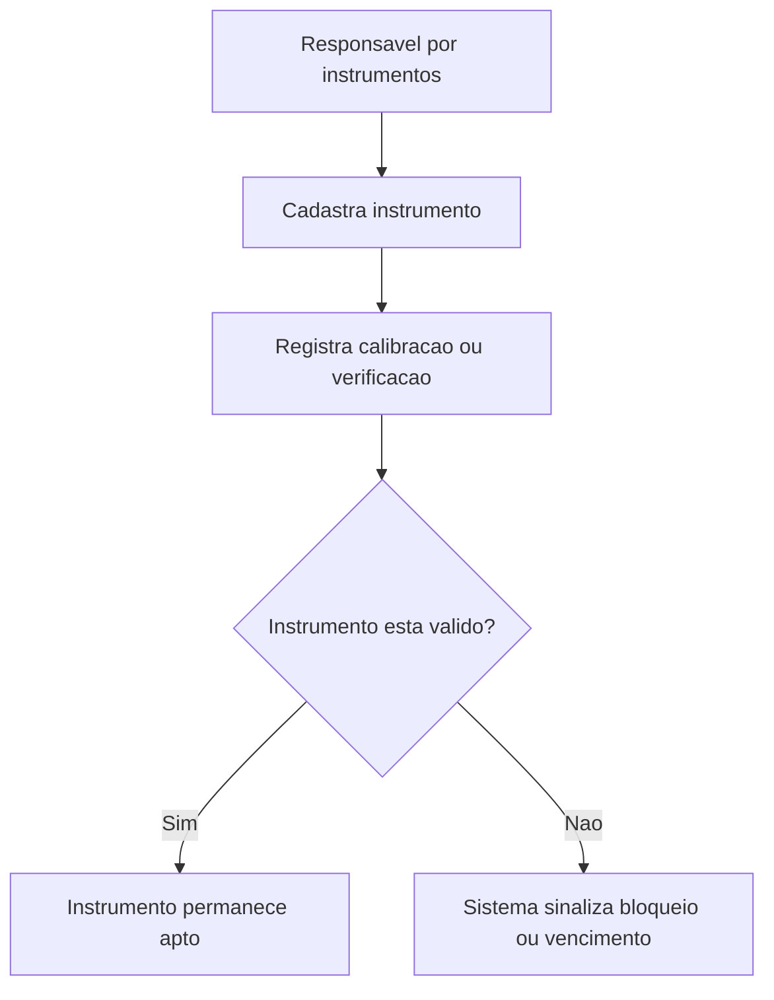

## Resultado de negocio

O Daton precisa controlar instrumentos de medicao para evitar uso de equipamentos vencidos ou sem validade comprovada.

## Caso de uso na plataforma

O responsavel cadastra o instrumento, acompanha validade, anexa certificado e bloqueia o que nao estiver em condicao adequada.

## Fluxo esperado

1. o instrumento e cadastrado com sua identificacao e validade
2. certificados e verificacoes sao anexados ao historico
3. o sistema acompanha vencimentos
4. instrumentos fora de validade deixam de ser considerados aptos

## Requisitos tecnicos essenciais

- manter inventario de instrumentos com validade e certificados
- registrar calibracao, verificacao e historico
- permitir sinalizacao ou bloqueio por vencimento

## Criterios de pronto

- cada instrumento tem validade e historico rastreavel
- a plataforma alerta ou sinaliza instrumentos vencidos
- o controle suporta leitura auditavel do item 20

## Rastreabilidade

- PRD: C
- Story de referencia: C4
- Caminho do PRD: `docs/prds/c-gestao-de-infraestrutura-manutencao/gestao-de-infraestrutura-manutencao.md`
- Itens do Excel/ISO: Item 20 / clausula 7.1.5
- Situacao auditada: Planejado.
- Milestone: PRD C · Gestão de Infraestrutura / Manutenção

## Diagrama do fluxo

