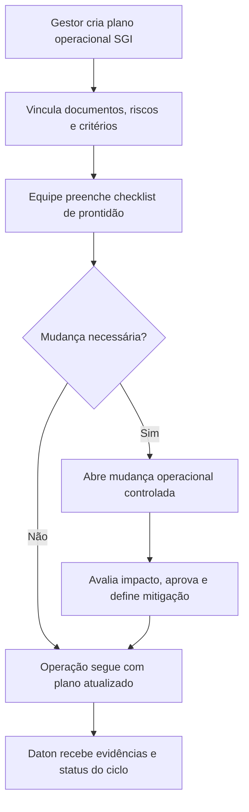

# PRD D: Planejamento da Produção / Realização do Serviço

## 1. Título e objetivo do sprint

**Macro-processo:** D) Planejamento da Produção / Realização do Serviço

**Objetivo do sprint:** criar a camada SGI que registra critérios, mudanças e evidências de planejamento operacional, sem executar a operação fim do cliente.

**Resultado esperado no produto:** o Daton passa a controlar planos operacionais, critérios de execução, mudanças e evidências da realização do serviço, integrando documentos, riscos, ações e anexos externos.

**Perguntas da planilha cobertas:** 21 a 23

**Itens ISO cobertos:** 8.1

## 2. Estado atual do produto

### O que já existe no repositório

- Planejamento estratégico, ações e riscos/oportunidades.
- Documentação controlada para procedimentos, instruções e formulários.
- Estrutura organizacional por unidade, departamento e cargo.

### Telas, fluxos, entidades e APIs já disponíveis

- Telas: `governanca/planejamento`, `governanca/riscos-oportunidades`, `qualidade/documentacao`.
- APIs/OpenAPI:
  - objetivos, ações e riscos;
  - documentos e workflow documental.

### O que é parcial, indireto ou insuficiente

- Não existe módulo de planejamento operacional por serviço, contrato, processo ou ciclo.
- Não existe workflow de mudança operacional controlada.
- Não existe registro estruturado da sequência de execução do serviço.
- Hoje os critérios podem existir apenas em documentos, sem evidência de uso no planejamento diário.

## 3. Gap de conformidade

| Pergunta | Item ISO | Evidência esperada no Daton | Cobertura atual | Observação |
| --- | --- | --- | --- | --- |
| 21 | 8.1 | Registro dos controles planejados sobre os processos de provisão | parcial | Há documentos e ações, mas não um plano operacional SGI estruturado. |
| 22 | 8.1 | Controle de mudanças planejadas e não planejadas com análise crítica | não implementado | Não existe workflow de change control operacional. |
| 23 | 8.1 | Sequência, critérios e características do processo de realização | parcial | A documentação pode descrever a sequência, mas o produto não a controla como objeto próprio. |

## 4. Escopo do sprint

### Capacidades a implementar

- Criar **plano operacional SGI** por processo/unidade/serviço com:
  - escopo;
  - critérios de execução;
  - documentos aplicáveis;
  - recursos necessários;
  - riscos vinculados.
- Criar **checklist de prontidão operacional** antes da execução.
- Criar **workflow de mudança operacional** com:
  - motivo;
  - impacto;
  - aprovação;
  - ação mitigatória.
- Criar **registro de evidências de planejamento** por ciclo de operação.

### Integrações e evidências externas

- A execução do serviço pode permanecer em TMS/ERP/WMS externo.
- O Daton armazenará critérios, aprovações e evidências da preparação, não a orquestração completa do serviço.

### Fora do escopo do sprint

- Agendamento operacional detalhado da frota ou da produção.
- Roteirização, despacho ou controle de chão de fábrica.

## 5. User stories

### Story D1

**Como** gestor operacional/SGQ, **quero** criar um plano operacional por processo ou tipo de serviço, **para** comprovar que a realização foi planejada sob critérios definidos.

**Critérios de aceitação**

- O plano possui processo, unidade, documentos aplicáveis e critérios.
- O plano referencia riscos, recursos e responsáveis.
- O sistema mantém histórico de revisões do plano.

### Story D2

**Como** líder de operação, **quero** registrar prontidão antes da execução, **para** evidenciar que os controles mínimos foram checados.

**Critérios de aceitação**

- O checklist de prontidão é configurável por processo.
- Cada item gera evidência, responsável e timestamp.
- A execução pode ser bloqueada logicamente quando itens críticos estiverem pendentes.

### Story D3

**Como** responsável de processo, **quero** tratar mudanças operacionais de forma controlada, **para** evitar impacto adverso na conformidade.

**Critérios de aceitação**

- Cada mudança registra causa, impacto, decisão e aprovador.
- O sistema exige ação de mitigação quando o impacto for relevante.
- Mudanças ficam vinculadas ao plano operacional e aos riscos associados.

## 6. Fluxo principal

## 7. Dados, permissões e integrações

### Entidades necessárias

- `operational_plans`
- `operational_plan_documents`
- `operational_readiness_checklists`
- `operational_changes`
- `operational_cycle_evidences`

### Regras de acesso

- `org_admin`: configura modelos e aprova mudanças críticas.
- `analyst`: cria planos, checklists, evidências e solicita mudanças.
- `operator`: executa checklist e anexa evidências.

### Integrações presumidas

- Upload manual de evidências operacionais.
- Integração futura com ERP/TMS para importar status do ciclo.

## 8. Critérios de pronto

- Existe plano operacional SGI por processo/serviço.
- Existe checklist de prontidão com trilha de execução.
- Existe workflow de mudança operacional controlada.
- Evidências do planejamento podem ser anexadas e auditadas.
- O módulo responde às perguntas 21 a 23 sem assumir a operação fim como responsabilidade nativa do Daton.

