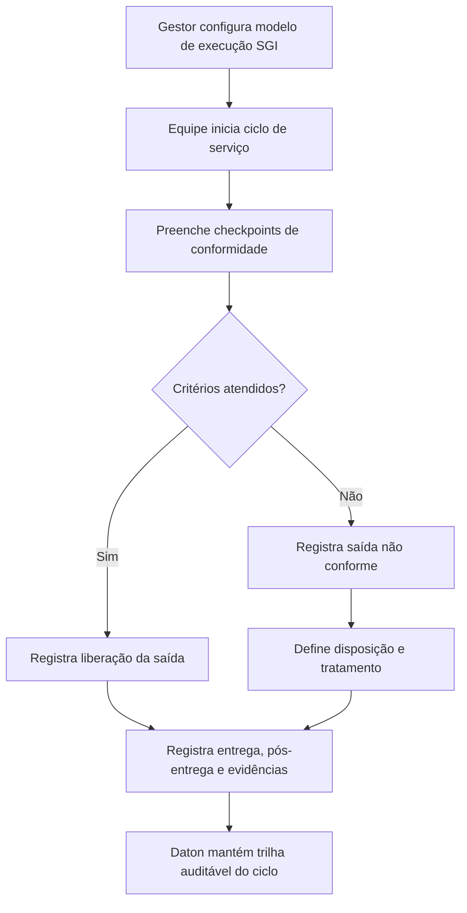

# PRD E: Produção / Prestação de Serviços

## 1. Título e objetivo do sprint

**Macro-processo:** E) Produção / Prestação de Serviços

**Objetivo do sprint:** criar a camada SGI para checkpoints, rastreabilidade documental, liberações, não conformidades de saída e evidências de prestação de serviço.

**Resultado esperado no produto:** o Daton registra requisitos operacionais, checkpoints de conformidade, liberação, pós-entrega e não conformidades de saída, ainda que a execução material do serviço permaneça externa.

**Perguntas da planilha cobertas:** 24 a 33

**Itens ISO cobertos:** 8.5.1, 8.5.2, 8.5.3, 8.5.4, 8.5.5, 8.6, 8.7

## 2. Estado atual do produto

### O que já existe no repositório

- Documentação controlada com versionamento e distribuição.
- Planejamento estratégico com ações e riscos.
- Storage e anexos para evidências.

### Telas, fluxos, entidades e APIs já disponíveis

- Telas: `qualidade/documentacao`, `governanca/*`.
- APIs/OpenAPI:
  - documentos, anexos, aprovações e distribuição;
  - governança, riscos e ações.

### O que é parcial, indireto ou insuficiente

- Documentos existem, mas não há **checkpoints operacionais por ciclo de prestação**.
- Não existe **registro de rastreabilidade** de saídas.
- Não existe **controle de propriedade do cliente**.
- Não existe **liberação formal de produto/serviço**.
- Não existe **controle de saídas não conformes**.

## 3. Gap de conformidade

| Pergunta | Item ISO | Evidência esperada no Daton | Cobertura atual | Observação |
| --- | --- | --- | --- | --- |
| 24 | 8.5.1.a | Instruções/requisitos documentados por atividade/resultado | parcial | O módulo de documentos permite manter instruções, mas sem execução operacional vinculada. |
| 25 | 8.5.1.c | Monitoramento e medição dos critérios de aceitação | não implementado | Não existem checkpoints estruturados por serviço ou lote operacional. |
| 26 | 8.5.1.f | Validação de processos quando aplicável | não implementado | Não existe workflow de validação periódica de processo. |
| 27 | 8.5.1.g-h | Prevenção de erro humano, liberação, entrega e pós-entrega | não implementado | O produto não possui controles operacionais para essas etapas. |
| 28 | 8.5.2 | Identificação e rastreabilidade de saídas | não implementado | Não há registro de lote, serviço, entrega ou rastreio de saída. |
| 29 | 8.5.3 | Controle de propriedade do cliente/provedor externo | não implementado | Não existe cadastro específico para ativos ou materiais de terceiros. |
| 30 | 8.5.4 | Preservação das saídas | não implementado | Não existe checklist ou controle de preservação da saída. |
| 31 | 8.5.5 | Atividades pós-entrega | não implementado | Não existe módulo de pós-entrega/garantia/assistência. |
| 32 | 8.6 | Liberação planejada de produto/serviço | não implementado | Não há aprovação ou gate de liberação por ciclo de serviço. |
| 33 | 8.7 | Controle de saídas não conformes | não implementado | Não existe módulo de saída não conforme separado da futura CAPA do macro A. |

## 4. Escopo do sprint

### Capacidades a implementar

- Criar **modelos de execução SGI** por tipo de serviço/processo.
- Criar **checkpoints de conformidade** com critério de aceitação.
- Criar **registro de liberação** por ciclo/ordem/serviço.
- Criar **registro de propriedade de cliente/terceiro** quando aplicável.
- Criar **registro de saída não conforme** voltado à operação/entrega.
- Criar **registro de pós-entrega** para ocorrências, garantia, retorno e feedback técnico.

### Integrações e evidências externas

- O ciclo físico do serviço pode ocorrer em sistema externo.
- O Daton deve aceitar anexos, importações e registros manuais do que foi executado e liberado.

### Fora do escopo do sprint

- Execução transacional completa do serviço.
- Telemetria, tracking de frota ou rastreio de produção em tempo real.

## 5. User stories

### Story E1

**Como** responsável do processo, **quero** configurar checkpoints de conformidade por tipo de serviço, **para** garantir critérios mínimos antes da liberação.

**Critérios de aceitação**

- O checkpoint possui item, critério, obrigatoriedade e evidência requerida.
- O modelo pode ser associado a uma unidade e a um processo.
- O sistema registra quem executou e quando.

### Story E2

**Como** operador/líder, **quero** registrar a liberação de uma saída, **para** demonstrar que o serviço foi aceito sob critérios planejados.

**Critérios de aceitação**

- A liberação exige status, responsável e evidências.
- O sistema registra pendências impeditivas.
- A liberação pode ser vinculada a documentos, cliente e unidade.

### Story E3

**Como** gestor SGQ, **quero** controlar saídas não conformes, **para** segregar ocorrências operacionais e disparar tratamento adequado.

**Critérios de aceitação**

- A saída não conforme registra descrição, impacto e disposição.
- É possível vincular a uma futura NC/CAPA do macro A.
- O histórico permanece auditável mesmo após correção.

### Story E4

**Como** responsável de atendimento, **quero** registrar pós-entrega e propriedade de cliente, **para** comprovar continuidade do controle após a execução principal.

**Critérios de aceitação**

- Há registros separados para propriedade de terceiros e ocorrências pós-entrega.
- O sistema aceita anexos e responsáveis.
- O histórico pode ser consultado por cliente, processo e unidade.

## 6. Fluxo principal

## 7. Dados, permissões e integrações

### Entidades necessárias

- `service_execution_models`
- `service_execution_checkpoints`
- `service_execution_cycles`
- `service_release_records`
- `third_party_property_records`
- `service_post_delivery_records`
- `nonconforming_outputs`

### Regras de acesso

- `org_admin`: configura modelos e critérios.
- `analyst`: acompanha ciclos, liberações e não conformidades.
- `operator`: executa checkpoints e envia evidências.

### Integrações presumidas

- Importação futura de ordens/entregas de sistema externo.
- Upload de canhotos, laudos, fotos, relatórios e comprovantes.

## 8. Critérios de pronto

- Existem modelos de checkpoints por processo/serviço.
- Existe liberação formal de saída com trilha de evidência.
- Existe controle de propriedade de terceiros e pós-entrega.
- Existe registro específico de saídas não conformes.
- O macro-processo responde às perguntas 24 a 33 como camada SGI, sem assumir a execução fim do negócio.

