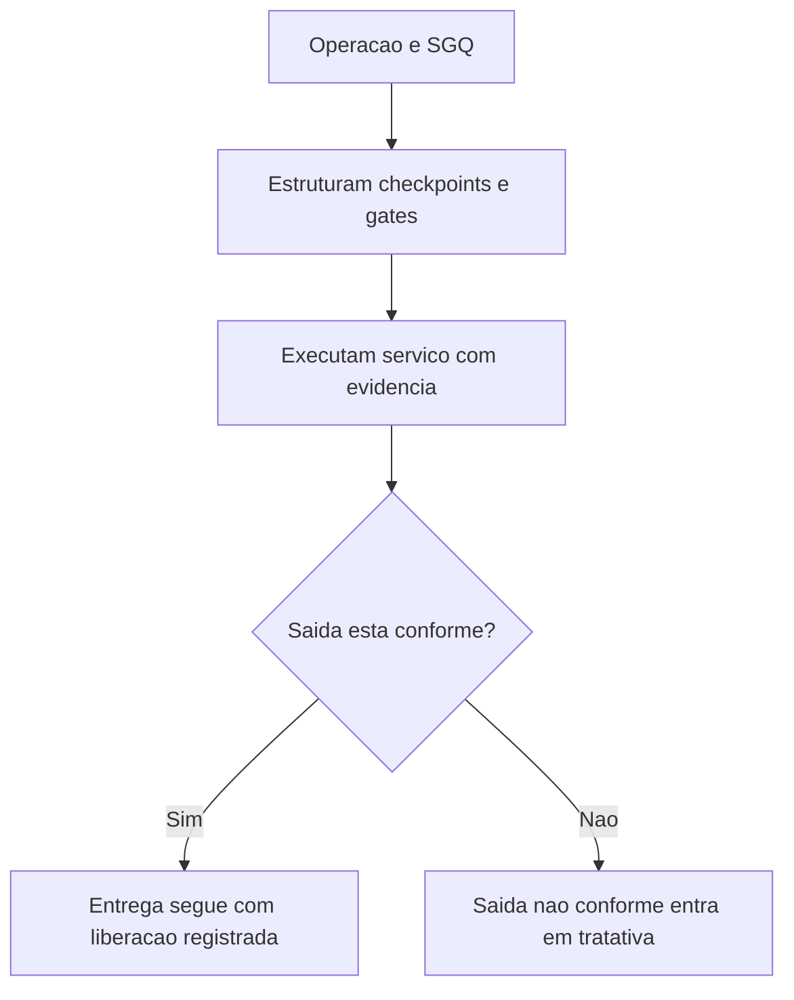

## Resultado de negocio

O Daton precisa estruturar a camada operacional do macro E para que a execucao, a liberacao, a pos-entrega e as saidas nao conformes tenham leitura auditavel.

## Caso de uso na plataforma

Qualidade e operacao usam esta base para transformar a realizacao do servico em fluxo controlado, sem depender apenas de documentos ou memoria da equipe.

## Fluxo esperado

1. o time organiza checkpoints, gates de liberacao e eventos operacionais
2. cada etapa relevante passa a gerar evidencia e decisao registrada
3. a saida conforme ou nao conforme fica tratada no proprio fluxo
4. a plataforma passa a sustentar a leitura do macroprocesso E de ponta a ponta

## Requisitos tecnicos essenciais

- estruturar backlog coerente para checkpoints, liberacao, pos-entrega e saida nao conforme
- reaproveitar documentos e evidencias do ecossistema atual
- manter rastreabilidade entre operacao, liberacao e desvio

## Criterios de pronto

- o macroprocesso E fica compreensivel como camada operacional do SGQ
- as stories E1 a E6 ficam ligadas ao mesmo fluxo
- os itens 26, 27, 31, 32 e 33 deixam de ficar implicitos

## Rastreabilidade

- PRD: E
- Story de referencia: E0
- Caminho do PRD: `docs/prds/e-producao-prestacao-de-servicos/producao-prestacao-de-servicos.md`
- Itens do Excel/ISO: Itens 24 a 33 / clausulas 8.5.1, 8.5.2, 8.5.3, 8.5.4, 8.5.5, 8.6 e 8.7
- Situacao auditada: Parcial em 24 e 33; planejado nos demais itens.
- Milestone: PRD E · Produção / Prestação de Serviços

## Diagrama do fluxo

---

## Rastreabilidade da migração

- Projeto de origem no Linear: Daton
- Issue Linear: WEB-26
- URL Linear: https://linear.app/web-star-studio/issue/WEB-26/consolidar-a-execucao-controlada-e-a-entrega-conforme
- PRD / milestone: PRD E · Produção / Prestação de Serviços
- Código PRD: E
- Labels: prd:e, type:foundation, source:prd
- Responsável original: Doug Araújo
- Status original: Backlog
- Prioridade original: High
- Migrado via API FlowDeck em: 2026-04-01T16:20:03.140Z