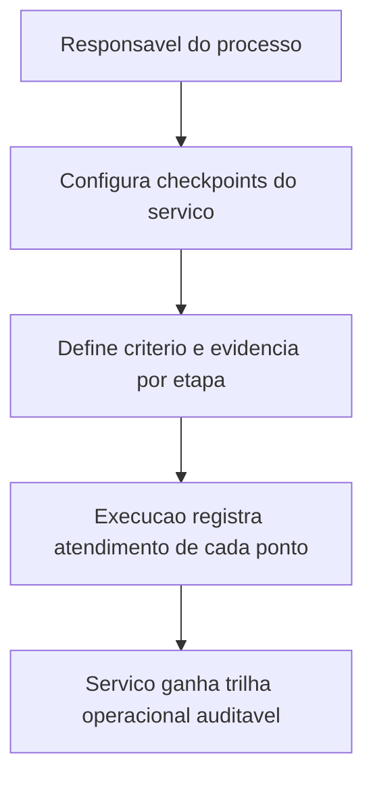

## Resultado de negocio

O Daton precisa registrar checkpoints de conformidade por servico ou processo para que a execucao siga criterios minimos definidos pela organizacao.

## Caso de uso na plataforma

O responsavel configura o que deve ser checado durante a realizacao do servico e usa isso como base para rastreabilidade operacional.

## Fluxo esperado

1. o usuario define os checkpoints do servico
2. associa criterios e evidencias requeridas
3. a execucao passa a registrar o atendimento de cada ponto
4. a organizacao ganha leitura estruturada do que foi controlado

## Requisitos tecnicos essenciais

- manter modelo de checkpoints e criterios por servico ou processo
- permitir evidencias operacionais em cada ponto
- preparar a base para rastreabilidade da saida

## Criterios de pronto

- os checkpoints podem ser definidos e reutilizados
- cada ponto pode exigir evidencia ou confirmacao
- o fluxo operacional passa a ter leitura estruturada

## Rastreabilidade

- PRD: E
- Story de referencia: E1
- Caminho do PRD: `docs/prds/e-producao-prestacao-de-servicos/producao-prestacao-de-servicos.md`
- Itens do Excel/ISO: Itens 24, 25, 26 e 28 / clausula 8.5.1 e 8.5.2
- Situacao auditada: Parcial em 24; planejado nos demais desdobramentos.
- Milestone: PRD E · Produção / Prestação de Serviços

## Diagrama do fluxo

---

## Rastreabilidade da migração

- Projeto de origem no Linear: Daton
- Issue Linear: WEB-27
- URL Linear: https://linear.app/web-star-studio/issue/WEB-27/definir-checkpoints-de-conformidade-por-servico
- PRD / milestone: PRD E · Produção / Prestação de Serviços
- Código PRD: E
- Labels: prd:e, type:story, source:prd
- Responsável original: Doug Araújo
- Status original: Backlog
- Prioridade original: Medium
- Migrado via API FlowDeck em: 2026-04-01T16:20:01.876Z