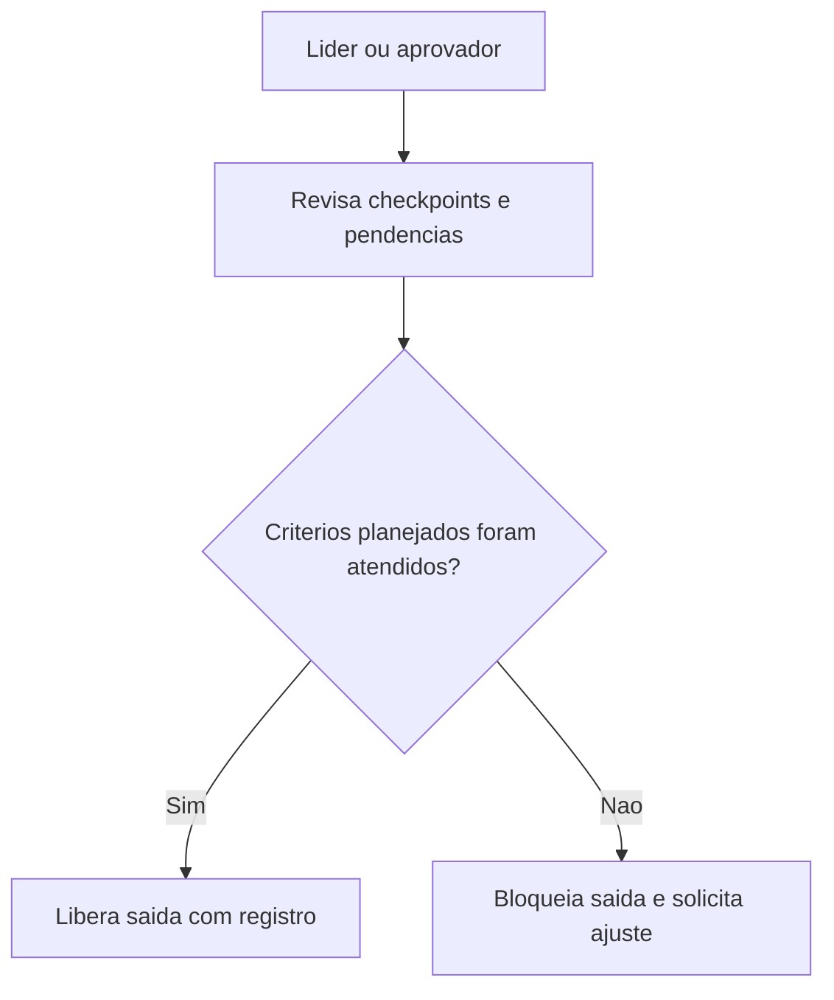

## Resultado de negocio

O Daton precisa garantir que a saida so seja liberada quando os criterios planejados estiverem atendidos e a responsabilidade pela decisao estiver clara.

## Caso de uso na plataforma

Ao final da execucao, o lider ou aprovador confere pendencias, valida o atendimento e libera ou bloqueia a saida.

## Fluxo esperado

1. o usuario revisa os checkpoints e pendencias da execucao
2. analisa se os criterios planejados foram atendidos
3. decide pela liberacao ou bloqueio da saida
4. a decisao fica registrada com responsavel e evidencias

## Requisitos tecnicos essenciais

- manter gate de liberacao com bloqueios e anexos
- registrar responsavel, data e justificativa da decisao
- preparar interface com validacao de processos especiais quando aplicavel

## Criterios de pronto

- a saida nao e liberada sem decisao registrada
- pendencias impeditivas bloqueiam o fluxo
- a organizacao consegue comprovar quem liberou e com base em que

## Rastreabilidade

- PRD: E
- Story de referencia: E2
- Caminho do PRD: `docs/prds/e-producao-prestacao-de-servicos/producao-prestacao-de-servicos.md`
- Itens do Excel/ISO: Itens 26, 27, 28 e 32 / clausulas 8.5.1, 8.5.2 e 8.6
- Situacao auditada: Planejado.
- Milestone: PRD E · Produção / Prestação de Serviços

## Diagrama do fluxo

---

## Rastreabilidade da migração

- Projeto de origem no Linear: Daton
- Issue Linear: WEB-28
- URL Linear: https://linear.app/web-star-studio/issue/WEB-28/controlar-a-liberacao-planejada-das-saidas
- PRD / milestone: PRD E · Produção / Prestação de Serviços
- Código PRD: E
- Labels: prd:e, type:story, source:prd
- Responsável original: Doug Araújo
- Status original: Backlog
- Prioridade original: Medium
- Migrado via API FlowDeck em: 2026-04-01T16:20:00.333Z