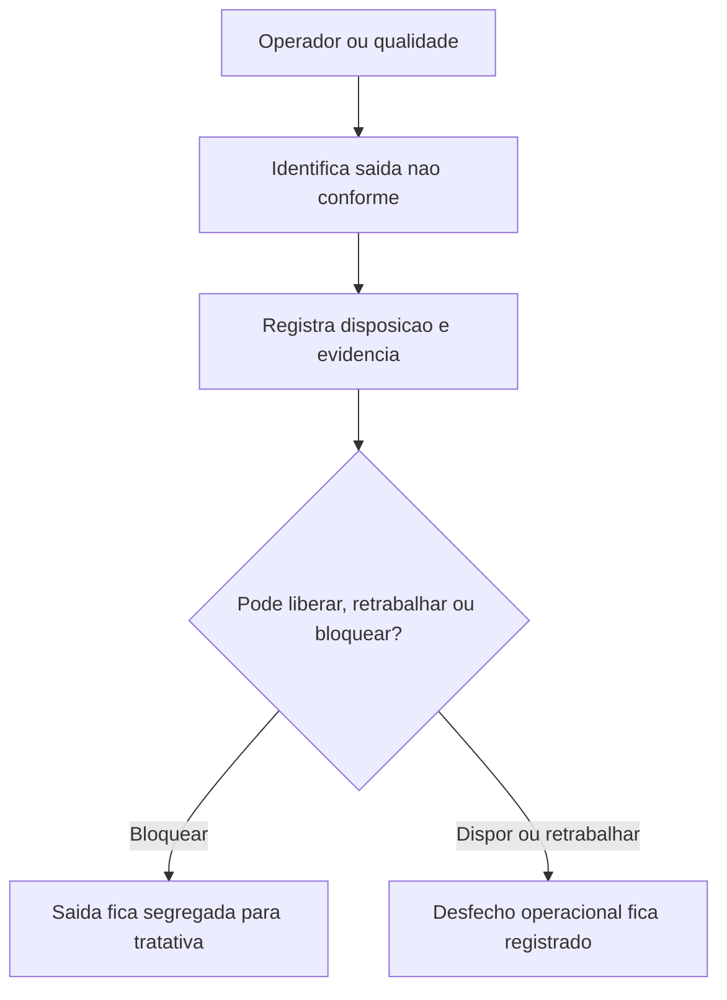

## Resultado de negocio

O Daton precisa separar a saida nao conforme da nao conformidade sistemica geral, tratando o evento operacional diretamente no fluxo de execucao.

## Caso de uso na plataforma

Quando a entrega ou saida nao atende ao criterio esperado, o usuario registra disposicao, bloqueio e desdobramento sem perder o contexto operacional.

## Fluxo esperado

1. uma saida e identificada como nao conforme
2. o usuario registra a ocorrencia e a disposicao adotada
3. o sistema bloqueia, reclassifica ou encaminha o tratamento
4. o historico da ocorrencia fica ligado ao ciclo operacional

## Requisitos tecnicos essenciais

- criar registro proprio de saida nao conforme
- permitir vinculo opcional com o macro A quando houver NC sistemica
- registrar disposicao, responsavel e evidencias

## Criterios de pronto

- saida nao conforme pode ser tratada no proprio fluxo operacional
- a ocorrencia nao depende de abrir NC geral para existir
- o historico mostra disposicao e desfecho do evento

## Rastreabilidade

- PRD: E
- Story de referencia: E3
- Caminho do PRD: `docs/prds/e-producao-prestacao-de-servicos/producao-prestacao-de-servicos.md`
- Itens do Excel/ISO: Item 33 / clausula 8.7
- Situacao auditada: Parcial.
- Milestone: PRD E · Produção / Prestação de Serviços

## Diagrama do fluxo

---

## Rastreabilidade da migração

- Projeto de origem no Linear: Daton
- Issue Linear: WEB-29
- URL Linear: https://linear.app/web-star-studio/issue/WEB-29/tratar-saidas-nao-conformes-como-evento-operacional
- PRD / milestone: PRD E · Produção / Prestação de Serviços
- Código PRD: E
- Labels: prd:e, type:story, source:prd
- Responsável original: Doug Araújo
- Status original: Backlog
- Prioridade original: Medium
- Migrado via API FlowDeck em: 2026-04-01T16:19:59.039Z