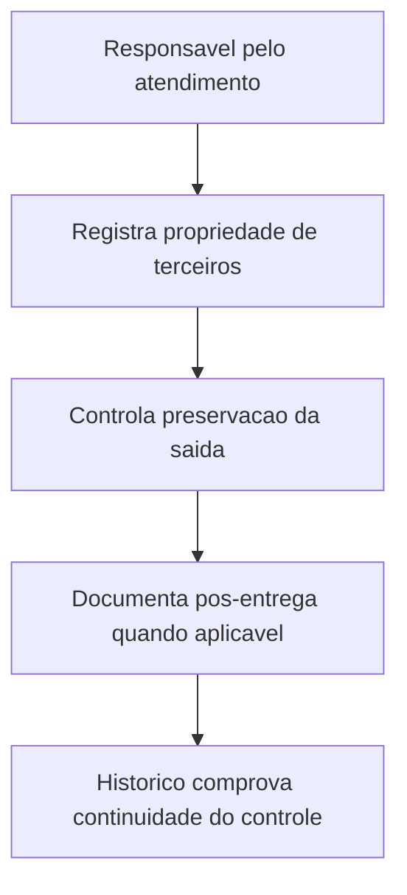

## Resultado de negocio

O Daton precisa registrar propriedade de terceiros, preservacao da saida e eventos de pos-entrega sem depender de controles soltos fora da plataforma.

## Caso de uso na plataforma

A equipe registra o que pertence ao cliente ou a terceiros, acompanha a preservacao da saida e documenta a pos-entrega quando ela existir.

## Fluxo esperado

1. o usuario identifica propriedade de terceiros envolvida
2. registra cuidados de preservacao e acondicionamento
3. documenta evento de pos-entrega ou acompanhamento posterior
4. o historico mostra que o controle continuou apos a execucao principal

## Requisitos tecnicos essenciais

- manter registros separados para propriedade de terceiros e pos-entrega
- suportar evidencias de preservacao e acompanhamento
- preservar ligacao com o servico ou ciclo operacional

## Criterios de pronto

- propriedade de terceiros pode ser registrada e acompanhada
- a preservacao da saida possui evidencia rastreavel
- a pos-entrega passa a existir como objeto proprio do fluxo

## Rastreabilidade

- PRD: E
- Story de referencia: E4
- Caminho do PRD: `docs/prds/e-producao-prestacao-de-servicos/producao-prestacao-de-servicos.md`
- Itens do Excel/ISO: Itens 27, 29, 30 e 31 / clausulas 8.5.1, 8.5.3, 8.5.4 e 8.5.5
- Situacao auditada: Planejado.
- Milestone: PRD E · Produção / Prestação de Serviços

## Diagrama do fluxo

---

## Rastreabilidade da migração

- Projeto de origem no Linear: Daton
- Issue Linear: WEB-30
- URL Linear: https://linear.app/web-star-studio/issue/WEB-30/registrar-propriedade-de-terceiros-e-acoes-de-pos-entrega
- PRD / milestone: PRD E · Produção / Prestação de Serviços
- Código PRD: E
- Labels: prd:e, type:story, source:prd
- Responsável original: Doug Araújo
- Status original: Backlog
- Prioridade original: Medium
- Migrado via API FlowDeck em: 2026-04-01T16:19:57.805Z