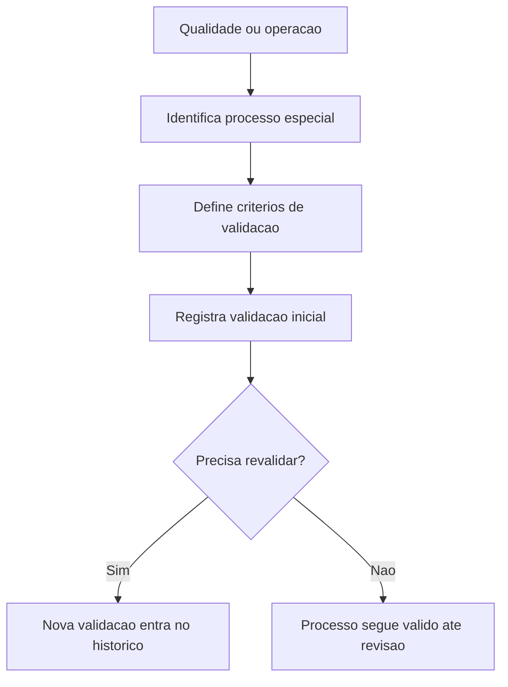

## Resultado de negocio

O Daton precisa permitir que a organizacao valide e revalide processos especiais quando o resultado nao puder ser totalmente verificado apenas ao final da execucao.

## Caso de uso na plataforma

Qualidade e operacao definem quais processos exigem validacao especial e acompanham sua validade, criterios e revalidacao.

## Fluxo esperado

1. o usuario identifica um processo especial ou critico
2. define criterios de validacao inicial
3. registra revisoes e revalidacoes quando necessario
4. a organizacao passa a demonstrar controle do item 26 sem ambiguidade

## Requisitos tecnicos essenciais

- manter fluxo proprio de validacao e revalidacao
- registrar vigencia, criterio, responsavel e evidencia
- vincular a validacao ao servico ou processo correspondente

## Criterios de pronto

- processos especiais podem ser marcados e validados
- revalidacoes ficam registradas com historico
- o item 26 passa a ter cobertura explicita no roadmap

## Rastreabilidade

- PRD: E
- Story de referencia: E5
- Caminho do PRD: `docs/prds/e-producao-prestacao-de-servicos/producao-prestacao-de-servicos.md`
- Itens do Excel/ISO: Item 26 / clausula 8.5.1.f
- Situacao auditada: Planejado; gap explicitado no rebaseline do PRD E.
- Milestone:

## Diagrama do fluxo

---

## Rastreabilidade da migração

- Projeto de origem no Linear: Daton
- Issue Linear: WEB-69
- URL Linear: https://linear.app/web-star-studio/issue/WEB-69/validar-processos-especiais-quando-aplicavel
- PRD / milestone: PRD E · Produção / Prestação de Serviços
- Código PRD: E
- Labels: prd:e, type:story, source:prd
- Responsável original: sem responsável
- Status original: Todo
- Prioridade original: None
- Migrado via API FlowDeck em: 2026-04-01T16:19:18.271Z