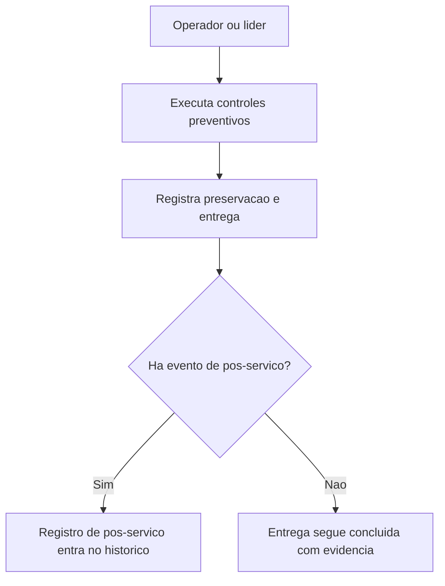

## Resultado de negocio

O Daton precisa explicitar controles de prevencao de erro humano, preservacao da saida, entrega e continuidade do controle apos a execucao principal.

## Caso de uso na plataforma

A operacao usa checklists preventivos e registros de entrega ou pos-servico para reduzir falhas de execucao e perda de controle apos a liberacao.

## Fluxo esperado

1. o usuario executa controles preventivos antes ou durante a realizacao
2. registra como a saida foi preservada e entregue
3. documenta eventos de pos-servico quando aplicavel
4. o sistema passa a cobrir de forma clara os itens 27, 30 e 31

## Requisitos tecnicos essenciais

- manter checklists preventivos e evidencias de entrega
- registrar preservacao da saida e eventos de pos-servico
- integrar esse fluxo aos gates de liberacao existentes

## Criterios de pronto

- controles de prevencao de erro humano ficam visiveis no fluxo
- preservacao e entrega podem ser comprovadas
- os desdobramentos de pos-servico ficam auditaveis

## Rastreabilidade

- PRD: E
- Story de referencia: E6
- Caminho do PRD: `docs/prds/e-producao-prestacao-de-servicos/producao-prestacao-de-servicos.md`
- Itens do Excel/ISO: Itens 27, 30 e 31 / clausulas 8.5.1.g-h, 8.5.4 e 8.5.5
- Situacao auditada: Planejado; gap explicitado no rebaseline do PRD E.
- Milestone:

## Diagrama do fluxo

---

## Rastreabilidade da migração

- Projeto de origem no Linear: Daton
- Issue Linear: WEB-70
- URL Linear: https://linear.app/web-star-studio/issue/WEB-70/prevenir-erro-humano-e-preservar-a-entrega-ate-o-pos-servico
- PRD / milestone: PRD E · Produção / Prestação de Serviços
- Código PRD: E
- Labels: prd:e, type:story, source:prd
- Responsável original: sem responsável
- Status original: Todo
- Prioridade original: None
- Migrado via API FlowDeck em: 2026-04-01T16:19:13.241Z