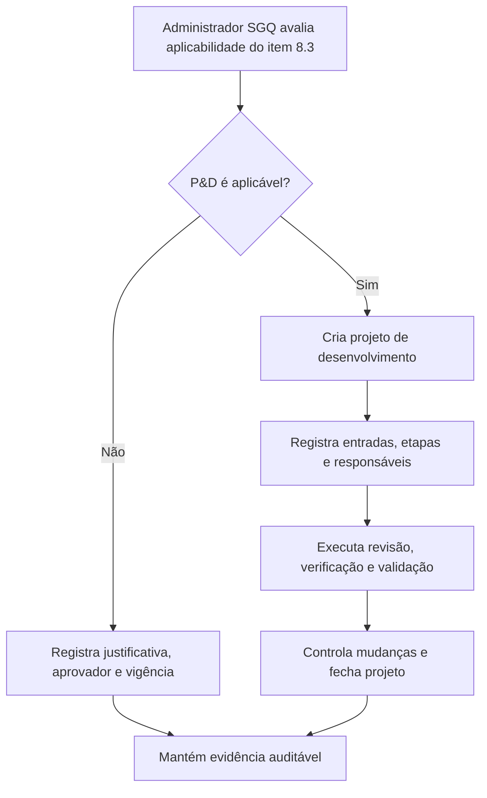

# PRD F: Projeto e Desenvolvimento

## 1. Título e objetivo do sprint

**Macro-processo:** F) Projeto e Desenvolvimento

**Objetivo do sprint:** implementar no Daton o controle de aplicabilidade de P&D e, quando aplicável, um fluxo leve de projeto e desenvolvimento aderente ao SGQ.

**Resultado esperado no produto:** o Daton consegue registrar de forma auditável se P&D é aplicável à organização e, quando for, controlar entradas, etapas, saídas e aprovações mínimas do processo.

**Perguntas da planilha cobertas:** 34

**Itens ISO cobertos:** 8.3

## 2. Estado atual do produto

### O que já existe no repositório

- Governança, documentos, ações, riscos e estrutura organizacional.

### Telas, fluxos, entidades e APIs já disponíveis

- Nenhum módulo dedicado a projeto e desenvolvimento.
- O máximo reaproveitável hoje é:
  - documentos controlados;
  - ações;
  - riscos e oportunidades;
  - workflow de revisão/aprovação em outros módulos.

### O que é parcial, indireto ou insuficiente

- Não existe regra explícita de **não aplicabilidade de P&D**.
- Não existe cadastro de projetos de desenvolvimento, entradas, saídas, revisões, verificações ou validações.

## 3. Gap de conformidade

| Pergunta | Item ISO | Evidência esperada no Daton | Cobertura atual | Observação |
| --- | --- | --- | --- | --- |
| 34 | 8.3 | Justificativa de aplicabilidade ou fluxo formal de P&D | não implementado | O repositório não possui módulo de P&D nem regra formal para marcar a cláusula como não aplicável. |

## 4. Escopo do sprint

### Capacidades a implementar

- Criar **configuração de aplicabilidade do requisito 8.3** por organização.
- Criar **registro de justificativa de não aplicabilidade**, com aprovador e validade.
- Criar, para organizações aplicáveis, um **workflow leve de P&D** com:
  - etapas;
  - entradas;
  - saídas;
  - revisão;
  - verificação;
  - validação;
  - mudança de projeto.

### Integrações e evidências externas

- Artefatos técnicos podem continuar em PLM, CAD ou ferramentas externas, desde que o Daton registre o controle SGQ e a evidência principal.

### Fora do escopo do sprint

- Gestão técnica profunda de engenharia.
- Versionamento de arquivos de produto em nível PLM.

## 5. User stories

### Story F1

**Como** administrador SGQ, **quero** registrar se o requisito 8.3 é aplicável à organização, **para** justificar formalmente a aderência ao escopo do sistema.

**Critérios de aceitação**

- A organização pode marcar o requisito como aplicável ou não aplicável.
- A decisão exige justificativa, responsável e aprovação.
- O histórico da decisão fica auditável.

### Story F2

**Como** responsável técnico, **quero** controlar projetos de desenvolvimento quando aplicáveis, **para** demonstrar planejamento e conformidade do processo.

**Critérios de aceitação**

- Cada projeto possui escopo, entradas, etapas e saídas.
- O sistema registra revisão, verificação e validação.
- Mudanças de projeto ficam historizadas.

## 6. Fluxo principal

## 7. Dados, permissões e integrações

### Entidades necessárias

- `requirement_applicability_decisions`
- `development_projects`
- `development_project_inputs`
- `development_project_reviews`
- `development_project_outputs`
- `development_project_changes`

### Regras de acesso

- `org_admin`: define aplicabilidade e aprova justificativas.
- `analyst`: mantém registros SGQ e acompanha o fluxo.
- `operator`: consulta ou colabora em etapas quando designado.

### Integrações presumidas

- Vínculo com documentos controlados e anexos.
- Possibilidade futura de integração com ferramenta técnica externa.

## 8. Critérios de pronto

- O Daton registra a aplicabilidade do item 8.3 por organização.
- Se não aplicável, há justificativa formal aprovada e auditável.
- Se aplicável, existe fluxo mínimo de P&D controlado.
- A plataforma passa a responder a pergunta 34 sem depender de controle informal externo.

