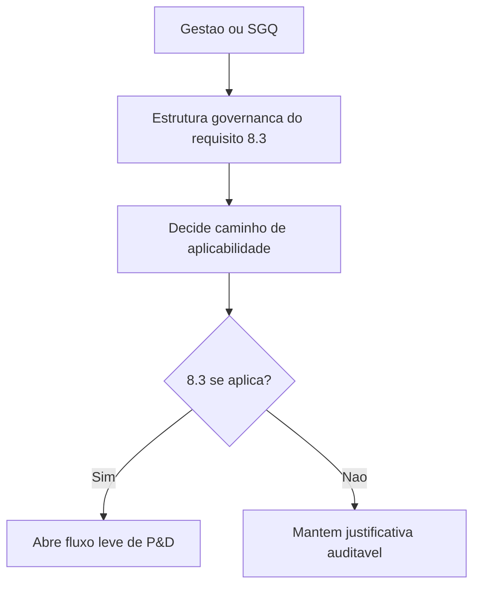

## Resultado de negocio

O Daton precisa organizar a governanca do requisito 8.3 antes de decidir se a organizacao realmente precisa operar um workflow de projeto e desenvolvimento.

## Caso de uso na plataforma

Produto e SGQ usam esta base para registrar a logica de aplicabilidade do requisito e preparar o fluxo de P&D somente quando ele fizer sentido.

## Fluxo esperado

1. a organizacao define como avaliar a aplicabilidade do requisito 8.3
2. registra o desdobramento possivel para o caso aplicavel
3. o backlog de P&D fica condicionado a essa decisao formal
4. o macroprocesso F deixa de ser um backlog abstrato

## Requisitos tecnicos essenciais

- estruturar backlog coerente para aplicabilidade e workflow leve de P&D
- manter caminho explicito de nao aplicavel justificado
- preservar rastreabilidade entre decisao e execucao futura

## Criterios de pronto

- o macroprocesso F fica compreensivel para negocio e SGQ
- a decisao de aplicabilidade aparece como primeira entrega obrigatoria
- o workflow de P&D nao e iniciado sem esse registro formal

## Rastreabilidade

- PRD: F
- Story de referencia: F0
- Caminho do PRD: `docs/prds/f-projeto-e-desenvolvimento/projeto-e-desenvolvimento.md`
- Itens do Excel/ISO: Item 34 / clausula 8.3
- Situacao auditada: Planejado.
- Milestone: PRD F · Projeto e Desenvolvimento

## Diagrama do fluxo

---

## Rastreabilidade da migração

- Projeto de origem no Linear: Daton
- Issue Linear: WEB-31
- URL Linear: https://linear.app/web-star-studio/issue/WEB-31/definir-a-governanca-de-projeto-e-desenvolvimento
- PRD / milestone: PRD F · Projeto e Desenvolvimento
- Código PRD: F
- Labels: prd:f, type:foundation, source:prd
- Responsável original: Doug Araújo
- Status original: Backlog
- Prioridade original: High
- Migrado via API FlowDeck em: 2026-04-01T16:19:56.615Z