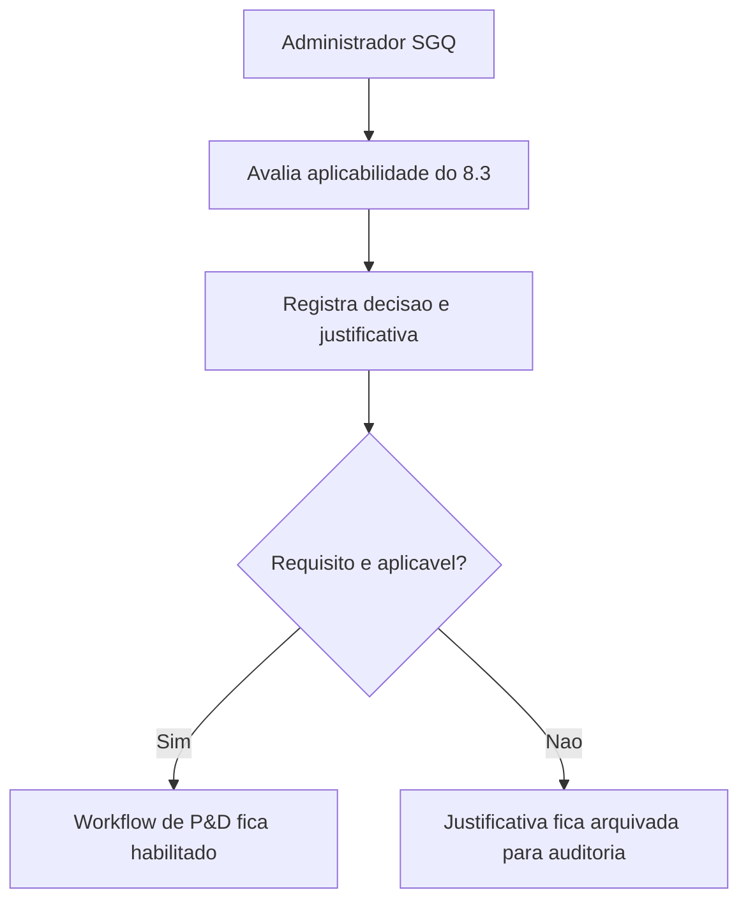

## Resultado de negocio

O Daton precisa permitir que a organizacao declare formalmente se o requisito 8.3 se aplica ao seu escopo e em que condicoes.

## Caso de uso na plataforma

A administracao SGQ registra a decisao de aplicabilidade e justifica o por que de seguir ou nao com um fluxo de P&D.

## Fluxo esperado

1. o usuario avalia se a organizacao realiza projeto e desenvolvimento no escopo considerado
2. registra a decisao e sua justificativa
3. o sistema mostra se o workflow de P&D precisa ser ativado
4. a resposta fica disponivel para auditoria

## Requisitos tecnicos essenciais

- manter registro formal de aplicabilidade por organizacao ou escopo
- suportar justificativa de nao aplicacao
- habilitar desdobramento para workflow quando aplicavel

## Criterios de pronto

- a organizacao consegue declarar aplicavel ou nao aplicavel
- a justificativa fica auditavel
- o desdobramento do workflow depende do resultado dessa decisao

## Rastreabilidade

- PRD: F
- Story de referencia: F1
- Caminho do PRD: `docs/prds/f-projeto-e-desenvolvimento/projeto-e-desenvolvimento.md`
- Itens do Excel/ISO: Item 34 / clausula 8.3
- Situacao auditada: Planejado.
- Milestone: PRD F · Projeto e Desenvolvimento

## Diagrama do fluxo

---

## Rastreabilidade da migração

- Projeto de origem no Linear: Daton
- Issue Linear: WEB-32
- URL Linear: https://linear.app/web-star-studio/issue/WEB-32/registrar-a-aplicabilidade-do-requisito-83
- PRD / milestone: PRD F · Projeto e Desenvolvimento
- Código PRD: F
- Labels: prd:f, type:story, source:prd
- Responsável original: Doug Araújo
- Status original: Backlog
- Prioridade original: Medium
- Migrado via API FlowDeck em: 2026-04-01T16:19:55.343Z