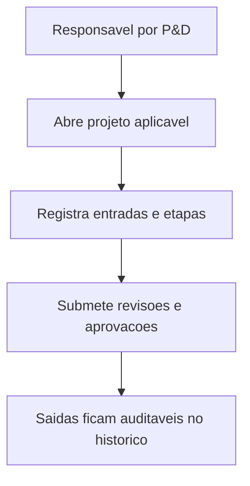

## Resultado de negocio

O Daton precisa controlar entradas, etapas, saidas e aprovacoes de projeto e desenvolvimento quando o requisito 8.3 for aplicavel ao contexto da organizacao.

## Caso de uso na plataforma

Depois da decisao de aplicabilidade, o responsavel gerencia um fluxo leve de P&D com revisoes e evidencias sem transformar o produto em PLM completo.

## Fluxo esperado

1. o projeto ou desenvolvimento e aberto na plataforma
2. entradas, etapas e saidas sao registradas
3. revisoes e aprovacoes acontecem com historico
4. o resultado final fica auditavel para o escopo aplicavel

## Requisitos tecnicos essenciais

- manter workflow leve com entradas, etapas, saidas e anexos
- registrar revisoes, verificacoes e aprovacoes
- condicionar a existencia do fluxo a aplicabilidade registrada

## Criterios de pronto

- o fluxo so existe quando 8.3 for aplicavel
- cada etapa possui responsavel e evidencia
- o historico do projeto pode ser lido de forma auditavel

## Rastreabilidade

- PRD: F
- Story de referencia: F2
- Caminho do PRD: `docs/prds/f-projeto-e-desenvolvimento/projeto-e-desenvolvimento.md`
- Itens do Excel/ISO: Item 34 / clausula 8.3
- Situacao auditada: Planejado.
- Milestone: PRD F · Projeto e Desenvolvimento

## Diagrama do fluxo

---

## Rastreabilidade da migração

- Projeto de origem no Linear: Daton
- Issue Linear: WEB-33
- URL Linear: https://linear.app/web-star-studio/issue/WEB-33/controlar-projetos-e-desenvolvimento-quando-aplicavel
- PRD / milestone: PRD F · Projeto e Desenvolvimento
- Código PRD: F
- Labels: prd:f, type:story, source:prd
- Responsável original: Doug Araújo
- Status original: Backlog
- Prioridade original: Medium
- Migrado via API FlowDeck em: 2026-04-01T16:19:54.157Z