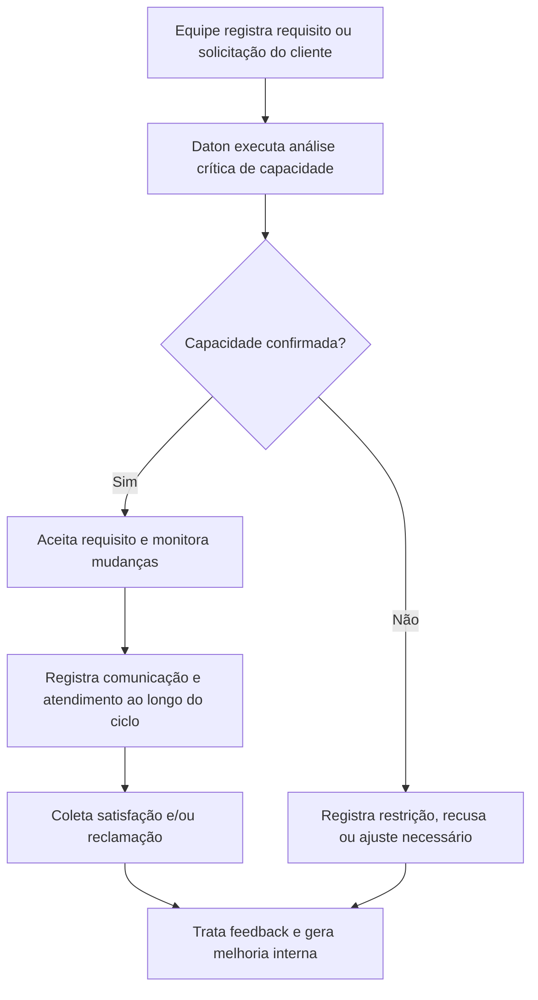

# PRD G: Vendas e Relacionamento com Clientes

## 1. Título e objetivo do sprint

**Macro-processo:** G) Vendas e Relacionamento com Clientes

**Objetivo do sprint:** criar a camada SGI para requisitos de cliente, análise crítica de capacidade, comunicação, satisfação e tratamento de reclamações.

**Resultado esperado no produto:** o Daton passa a registrar, revisar e evidenciar requisitos de cliente antes, durante e após a venda/prestação, além de capturar satisfação e reclamações com tratativa interna.

**Perguntas da planilha cobertas:** 35 a 40

**Itens ISO cobertos:** 8.2, 8.2.1, 9.1.2

## 2. Estado atual do produto

### O que já existe no repositório

- Documentação controlada.
- Governança com ações, riscos e objetivos.
- Estrutura organizacional, usuários e notificações.

### Telas, fluxos, entidades e APIs já disponíveis

- Não existe módulo dedicado de clientes, requisitos comerciais, reclamações ou satisfação.
- O que é reaproveitável:
  - documentos para procedimentos e modelos;
  - ações e riscos para tratar problemas detectados;
  - notificações internas.

### O que é parcial, indireto ou insuficiente

- Não há análise crítica de capacidade antes do aceite.
- Não há repositório de requisitos de cliente.
- Não há canal estruturado de comunicação com cliente.
- Não há medição de satisfação.
- Não há workflow de reclamação.

## 3. Gap de conformidade

| Pergunta | Item ISO | Evidência esperada no Daton | Cobertura atual | Observação |
| --- | --- | --- | --- | --- |
| 35 | 8.2 | Análise crítica da capacidade de atendimento ao cliente | não implementado | Não existe módulo de análise de contrato/pedido ou aceite. |
| 36 | 8.2 | Registro e controle dos requisitos do cliente | não implementado | Não há cadastro de requisitos por cliente, contrato ou serviço. |
| 37 | 8.2 | Canais e regras de comunicação com cliente | não implementado | Notificações atuais são internas, não voltadas a cliente. |
| 38 | 8.2 | Controle de alterações contratuais/pedidos | não implementado | Não existe gestão de mudanças em requisitos comerciais. |
| 39 | 8.2.1 / 9.1.2 | Avaliação de satisfação do cliente e uso para melhoria | não implementado | Não existe módulo de satisfação, pesquisa ou analytics de feedback. |
| 40 | 8.2.1 / 9.1.2 | Canal e tratativa de reclamações e sugestões | não implementado | Não existe central de reclamações com workflow interno. |

## 4. Escopo do sprint

### Capacidades a implementar

- Criar **cadastro de clientes** e **registro de requisitos** por relacionamento/contrato/serviço.
- Criar **workflow de análise crítica de capacidade** antes do aceite.
- Criar **registro de comunicação com cliente**:
  - solicitações;
  - requisitos;
  - mudanças;
  - confirmações.
- Criar **módulo de satisfação do cliente** com pesquisa, indicador e plano de ação.
- Criar **módulo de reclamações e sugestões** com tratativa, causa e vínculo com melhoria.

### Integrações e evidências externas

- Caso o cliente use CRM externo, o Daton pode receber importação ou evidência manual.
- O objetivo deste sprint é o controle SGQ dos requisitos do cliente, não o funil comercial completo.

### Fora do escopo do sprint

- Pipeline comercial completo.
- Proposta comercial, faturamento e gestão de oportunidades de venda.

## 5. User stories

### Story G1

**Como** responsável comercial/SGQ, **quero** registrar requisitos do cliente e revisar a capacidade de atendimento antes do aceite, **para** reduzir falhas de promessa e não conformidades.

**Critérios de aceitação**

- Cada requisito fica vinculado a cliente, tipo de serviço e unidade.
- A análise crítica registra decisão, restrições, responsável e data.
- Mudanças posteriores no requisito ficam historizadas.

### Story G2

**Como** atendimento ao cliente, **quero** registrar interações e mudanças de requisito, **para** comprovar comunicação controlada.

**Critérios de aceitação**

- O histórico mostra origem, conteúdo, responsável e anexos.
- O sistema diferencia solicitação, alteração, dúvida, reclamação e feedback.
- Alterações relevantes podem gerar notificação interna.

### Story G3

**Como** gestor de qualidade, **quero** medir satisfação e tratar reclamações, **para** usar feedback do cliente na melhoria do sistema.

**Critérios de aceitação**

- Pesquisas podem ser configuradas por ciclo/cliente/serviço.
- Reclamações geram workflow interno de tratativa.
- O resultado pode abrir risco, ação ou não conformidade quando pertinente.

## 6. Fluxo principal

## 7. Dados, permissões e integrações

### Entidades necessárias

- `customers`
- `customer_requirements`
- `customer_requirement_reviews`
- `customer_communications`
- `customer_satisfaction_surveys`
- `customer_feedback_records`

### Regras de acesso

- `org_admin`: configura estrutura e visibilidade do módulo.
- `analyst`: registra requisitos, análises, satisfação e reclamações.
- `operator`: consulta registros e executa tratativas quando designado.

### Integrações presumidas

- Importação futura de CRM ou help desk.
- Reuso de notificações, anexos e ações do ecossistema atual.

## 8. Critérios de pronto

- O Daton registra requisitos do cliente e análise crítica da capacidade.
- O Daton controla alterações e comunicação com histórico.
- O Daton mede satisfação e trata reclamações.
- O feedback do cliente pode gerar melhoria interna rastreável.
- O macro-processo responde às perguntas 35 a 40 como camada SGI.

