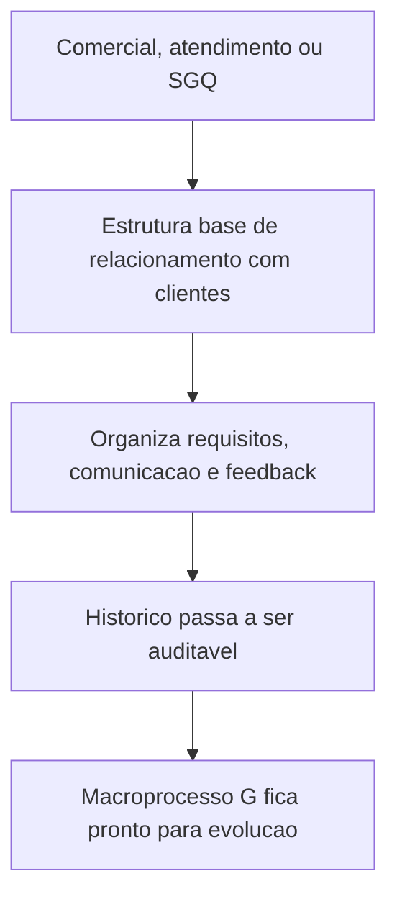

## Resultado de negocio

O Daton precisa organizar a base do macroprocesso G para que requisitos, comunicacao, satisfacao e reclamacoes de clientes deixem de ficar dispersos.

## Caso de uso na plataforma

Produto, comercial e SGQ usam esta base para transformar o relacionamento com clientes em leitura auditavel de requisito, resposta e melhoria.

## Fluxo esperado

1. a organizacao define o que precisa registrar do cliente
2. o backlog separa requisitos, comunicacao e feedback em frentes claras
3. cada interacao relevante passa a gerar historico e decisao
4. o macroprocesso G fica compreensivel para negocio e implantacao

## Requisitos tecnicos essenciais

- estruturar backlog coerente para requisitos, mudancas, satisfacao e reclamacoes
- reaproveitar anexos, notificacoes e historico do ecossistema atual
- preservar rastreabilidade com os itens 35 a 40

## Criterios de pronto

- o macroprocesso G fica legivel para negocio e SGQ
- as stories G1 a G3 ficam conectadas por um mesmo fluxo
- a camada de cliente nao depende de CRM externo para ser auditavel

## Rastreabilidade

- PRD: G
- Story de referencia: G0
- Caminho do PRD: `docs/prds/g-vendas-e-relacionamento-com-clientes/vendas-e-relacionamento-com-clientes.md`
- Itens do Excel/ISO: Itens 35 a 40 / clausulas 8.2, 8.2.1 e 9.1.2
- Situacao auditada: Planejado.
- Milestone: PRD G · Vendas e Relacionamento com Clientes

## Diagrama do fluxo

---

## Rastreabilidade da migração

- Projeto de origem no Linear: Daton
- Issue Linear: WEB-34
- URL Linear: https://linear.app/web-star-studio/issue/WEB-34/consolidar-requisitos-e-relacionamento-com-clientes
- PRD / milestone: PRD G · Vendas e Relacionamento com Clientes
- Código PRD: G
- Labels: prd:g, type:foundation, source:prd
- Responsável original: Doug Araújo
- Status original: Backlog
- Prioridade original: High
- Migrado via API FlowDeck em: 2026-04-01T16:19:52.419Z