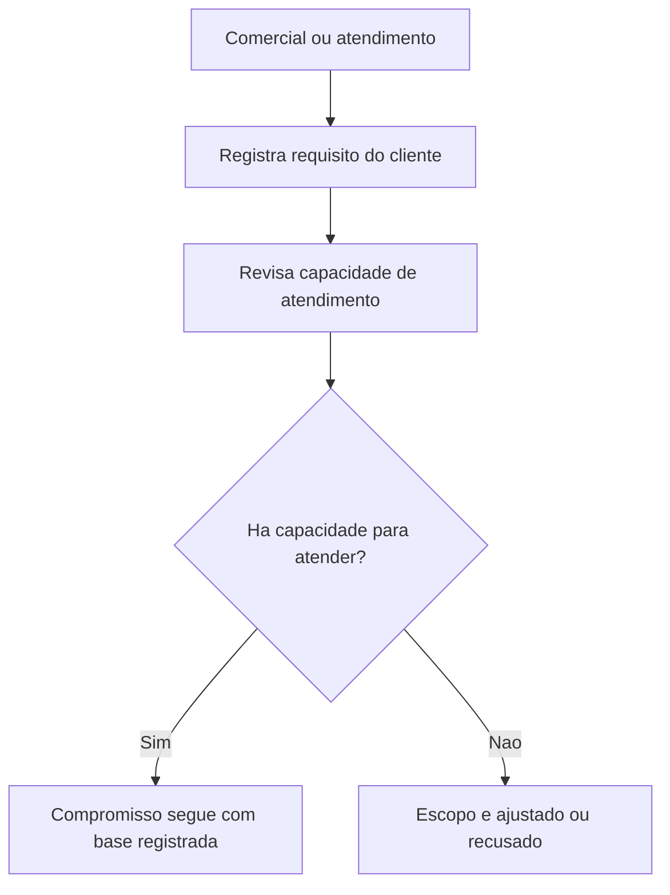

## Resultado de negocio

O Daton precisa registrar o que o cliente espera e comprovar que a organizacao revisou sua capacidade antes de assumir o compromisso.

## Caso de uso na plataforma

O time comercial ou de atendimento registra requisitos e faz analise critica de capacidade antes de aceitar o fornecimento ou servico.

## Fluxo esperado

1. o usuario registra os requisitos do cliente
2. analisa se a organizacao tem capacidade para atender
3. a decisao de aceite ou ajuste fica registrada
4. o historico protege a organizacao contra promessas sem base

## Requisitos tecnicos essenciais

- manter cadastro de requisitos por cliente ou servico
- registrar revisao de capacidade e decisao
- preservar vinculo com alteracoes futuras

## Criterios de pronto

- os requisitos do cliente podem ser registrados de forma auditavel
- a capacidade de atendimento e formalmente revisada
- a decisao de seguir, ajustar ou recusar fica historizada

## Rastreabilidade

- PRD: G
- Story de referencia: G1
- Caminho do PRD: `docs/prds/g-vendas-e-relacionamento-com-clientes/vendas-e-relacionamento-com-clientes.md`
- Itens do Excel/ISO: Itens 35 e 36 / clausula 8.2
- Situacao auditada: Planejado.
- Milestone: PRD G · Vendas e Relacionamento com Clientes

## Diagrama do fluxo

---

## Rastreabilidade da migração

- Projeto de origem no Linear: Daton
- Issue Linear: WEB-35
- URL Linear: https://linear.app/web-star-studio/issue/WEB-35/registrar-requisitos-do-cliente-e-revisar-capacidade-de-atendimento
- PRD / milestone: PRD G · Vendas e Relacionamento com Clientes
- Código PRD: G
- Labels: prd:g, type:story, source:prd
- Responsável original: Doug Araújo
- Status original: Backlog
- Prioridade original: Medium
- Migrado via API FlowDeck em: 2026-04-01T16:19:51.151Z