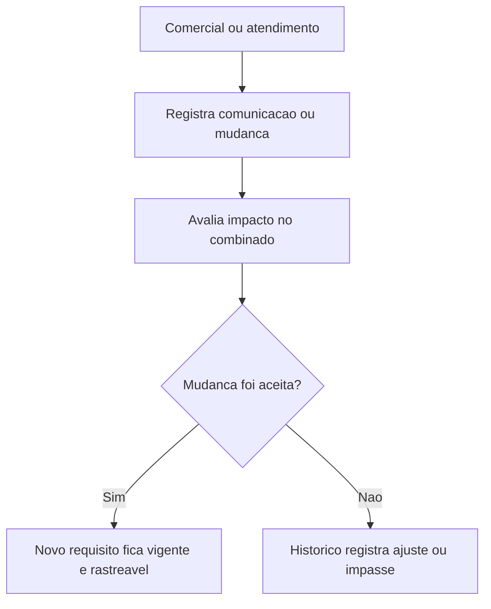

## Resultado de negocio

O Daton precisa registrar comunicacoes relevantes com clientes e tratar mudancas de requisito sem perder o historico do combinado.

## Caso de uso na plataforma

Sempre que um requisito muda ou uma comunicacao relevante acontece, a plataforma passa a guardar contexto, responsavel e impacto dessa alteracao.

## Fluxo esperado

1. o usuario registra a comunicacao ou a mudanca de requisito
2. identifica o que mudou e quem foi impactado
3. a organizacao avalia o efeito da mudanca
4. o novo combinado fica visivel e rastreavel

## Requisitos tecnicos essenciais

- manter historico de comunicacoes e alteracoes de requisito
- registrar impacto, responsavel e evidencias
- preservar versao do combinado com o cliente

## Criterios de pronto

- a comunicacao com cliente deixa trilha auditavel
- mudancas de requisito podem ser comparadas ao combinado anterior
- o historico mostra quem registrou e quando

## Rastreabilidade

- PRD: G
- Story de referencia: G2
- Caminho do PRD: `docs/prds/g-vendas-e-relacionamento-com-clientes/vendas-e-relacionamento-com-clientes.md`
- Itens do Excel/ISO: Itens 37 e 38 / clausula 8.2
- Situacao auditada: Planejado.
- Milestone: PRD G · Vendas e Relacionamento com Clientes

## Diagrama do fluxo

---

## Rastreabilidade da migração

- Projeto de origem no Linear: Daton
- Issue Linear: WEB-36
- URL Linear: https://linear.app/web-star-studio/issue/WEB-36/controlar-comunicacao-e-mudancas-de-requisito-com-clientes
- PRD / milestone: PRD G · Vendas e Relacionamento com Clientes
- Código PRD: G
- Labels: prd:g, type:story, source:prd
- Responsável original: Doug Araújo
- Status original: Backlog
- Prioridade original: Medium
- Migrado via API FlowDeck em: 2026-04-01T16:19:49.869Z