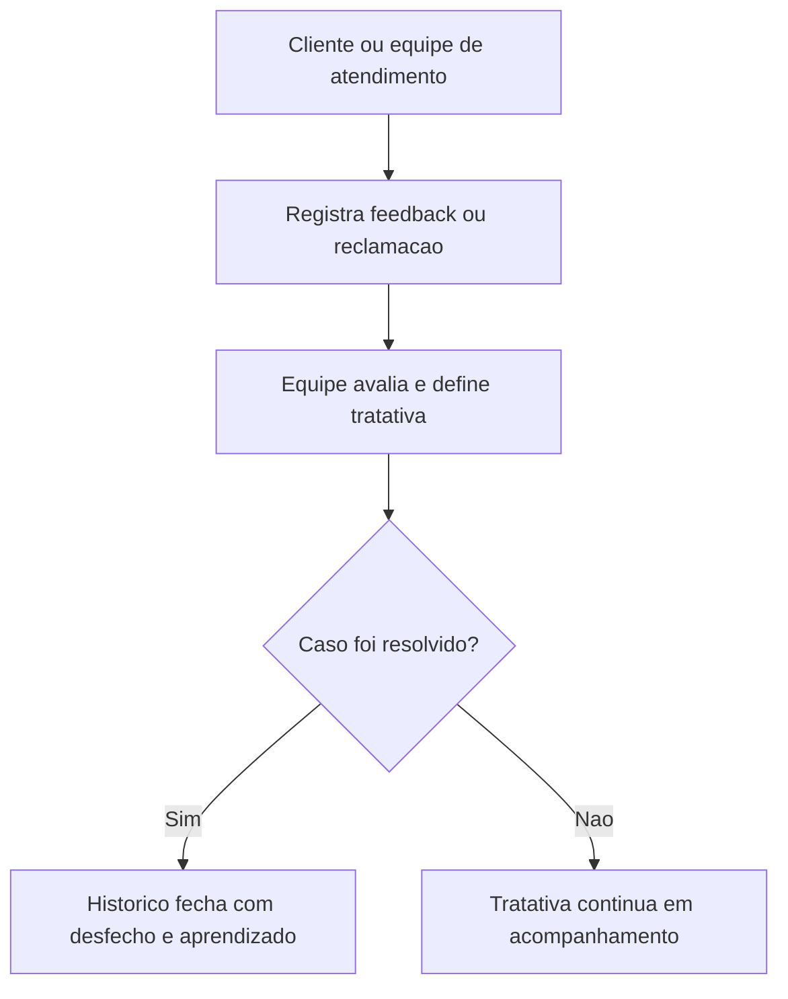

## Resultado de negocio

O Daton precisa capturar a voz do cliente, medir satisfacao e tratar reclamacoes ou sugestoes como insumo de melhoria do sistema.

## Caso de uso na plataforma

A organizacao registra feedback, acompanha tratativas e transforma percepcao do cliente em leitura gerencial e melhoria.

## Fluxo esperado

1. o cliente responde pesquisa ou registra reclamacao
2. a equipe avalia a gravidade e define tratativa
3. o andamento e o desfecho ficam registrados
4. a organizacao usa o feedback para priorizar melhoria

## Requisitos tecnicos essenciais

- manter pesquisas, indicadores e registros de feedback
- suportar tratativa interna e acompanhamento do caso
- preservar leitura consolidada de satisfacao

## Criterios de pronto

- pesquisas e reclamacoes podem ser registradas na plataforma
- cada caso pode ser acompanhado ate o desfecho
- o feedback pode ser usado como entrada de melhoria

## Rastreabilidade

- PRD: G
- Story de referencia: G3
- Caminho do PRD: `docs/prds/g-vendas-e-relacionamento-com-clientes/vendas-e-relacionamento-com-clientes.md`
- Itens do Excel/ISO: Itens 39 e 40 / clausulas 8.2.1 e 9.1.2
- Situacao auditada: Planejado.
- Milestone: PRD G · Vendas e Relacionamento com Clientes

## Diagrama do fluxo

---

## Rastreabilidade da migração

- Projeto de origem no Linear: Daton
- Issue Linear: WEB-37
- URL Linear: https://linear.app/web-star-studio/issue/WEB-37/medir-satisfacao-e-tratar-reclamacoes-de-clientes
- PRD / milestone: PRD G · Vendas e Relacionamento com Clientes
- Código PRD: G
- Labels: prd:g, type:story, source:prd
- Responsável original: Doug Araújo
- Status original: Backlog
- Prioridade original: Medium
- Migrado via API FlowDeck em: 2026-04-01T16:19:48.564Z