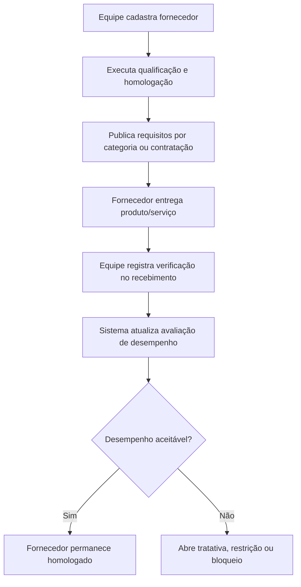

# PRD H: Gestão de Fornecedores

## 1. Título e objetivo do sprint

**Macro-processo:** H) Gestão de Fornecedores

**Objetivo do sprint:** criar o módulo SGI de qualificação, homologação, comunicação de requisitos, avaliação contínua e verificação de recebimento de fornecedores.

**Resultado esperado no produto:** o Daton passa a tratar fornecedores como partes controladas do SGQ, com cadastro, critérios, avaliações, evidências e histórico de conformidade.

**Perguntas da planilha cobertas:** 41 a 45

**Itens ISO cobertos:** 8.4, 8.6

## 2. Estado atual do produto

### O que já existe no repositório

- Documentação controlada.
- Estrutura organizacional.
- Ações e riscos em governança.
- Legislações e compliance por unidade.

### Telas, fluxos, entidades e APIs já disponíveis

- Não existe módulo específico de fornecedores.
- O que pode ser reaproveitado:
  - anexos/documentos;
  - ações corretivas futuras;
  - usuários e notificações.

### O que é parcial, indireto ou insuficiente

- Não há cadastro de fornecedores.
- Não há homologação ou qualificação.
- Não há comunicação formal de requisitos de aquisição.
- Não há avaliação periódica durante fornecimento.
- Não há inspeção/aceite no recebimento.

## 3. Gap de conformidade

| Pergunta | Item ISO | Evidência esperada no Daton | Cobertura atual | Observação |
| --- | --- | --- | --- | --- |
| 41 | 8.4 | Qualificação/homologação de fornecedores com critério de risco | não implementado | Não existe cadastro nem workflow de homologação de fornecedor. |
| 42 | 8.4 | Avaliação e homologação de produtos/serviços adquiridos | não implementado | Não existe catálogo de itens/serviços homologados. |
| 43 | 8.4 | Comunicação formal de requisitos de aquisição/contratação | não implementado | Não existe workflow de envio/ciência de requisitos ao fornecedor. |
| 44 | 8.4 | Avaliação contínua do fornecedor durante o fornecimento | não implementado | Não existe monitoramento de desempenho do fornecedor. |
| 45 | 8.4 / 8.6 | Verificação de conformidade no recebimento | não implementado | Não há módulo de recebimento com aceite/rejeição. |

## 4. Escopo do sprint

### Capacidades a implementar

- Criar **cadastro mestre de fornecedores**.
- Criar **workflow de homologação/qualificação** com:
  - categoria;
  - criticidade;
  - requisitos;
  - documentos obrigatórios;
  - parecer.
- Criar **catálogo de requisitos de aquisição** por categoria de fornecedor.
- Criar **avaliação periódica do fornecedor** com risco e desempenho.
- Criar **registro de verificação no recebimento** para produtos/serviços recebidos.

### Integrações e evidências externas

- ERP de compras ou almoxarifado pode seguir externo.
- O Daton registra decisão SGQ, critérios, anexos e histórico.

### Fora do escopo do sprint

- Processo completo de compras, cotação e pedido.
- Financeiro, contratos e contas a pagar.

## 5. User stories

### Story H1

**Como** comprador/SGQ, **quero** homologar fornecedores por categoria e criticidade, **para** reduzir risco de fornecimento.

**Critérios de aceitação**

- O fornecedor possui categoria, criticidade e status.
- O sistema exige documentos obrigatórios conforme a categoria.
- A homologação registra avaliador, decisão e validade.

### Story H2

**Como** gestor do processo, **quero** comunicar requisitos formais aos fornecedores, **para** assegurar entendimento do que deve ser fornecido.

**Critérios de aceitação**

- Requisitos podem ser mantidos em modelo por categoria.
- O envio ou a vinculação do requisito fica registrado.
- Mudanças de requisito ficam historizadas.

### Story H3

**Como** analista SGQ, **quero** avaliar o desempenho do fornecedor durante o fornecimento, **para** decidir manutenção, restrição ou bloqueio.

**Critérios de aceitação**

- A avaliação possui critérios, nota, risco e conclusão.
- Resultados ruins podem abrir ação ou bloqueio.
- O histórico do fornecedor fica disponível por período.

### Story H4

**Como** responsável pelo recebimento, **quero** registrar a verificação de conformidade do que foi recebido, **para** comprovar aceite ou rejeição.

**Critérios de aceitação**

- O recebimento pode gerar aceite, rejeição ou aceite com ressalva.
- Evidências e anexos podem ser vinculados.
- Não conformidades de fornecedor podem ser encaminhadas para tratamento.

## 6. Fluxo principal

## 7. Dados, permissões e integrações

### Entidades necessárias

- `suppliers`
- `supplier_categories`
- `supplier_qualification_reviews`
- `supplier_requirement_templates`
- `supplier_performance_reviews`
- `supplier_receipt_checks`

### Regras de acesso

- `org_admin`: configura categorias, regras e acesso.
- `analyst`: cadastra, homologa, avalia e registra recebimento.
- `operator`: executa checklist de recebimento quando designado.

### Integrações presumidas

- Upload de documentos obrigatórios.
- Integração futura com ERP de compras/recebimento.

## 8. Critérios de pronto

- Existe cadastro de fornecedores com homologação auditável.
- Existe comunicação formal de requisitos ao fornecedor.
- Existe avaliação contínua de desempenho.
- Existe verificação de conformidade no recebimento.
- O macro-processo responde às perguntas 41 a 45 como controle SGI de fornecedores.

