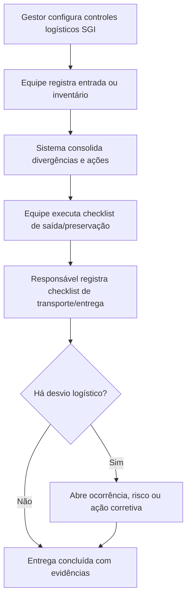

# PRD I: Logística

## 1. Título e objetivo do sprint

**Macro-processo:** I) Logística

**Objetivo do sprint:** criar a camada SGI para controles logísticos auditáveis de estoque, preservação, saída e conformidade de transporte, sem transformar o Daton em WMS/TMS.

**Resultado esperado no produto:** o Daton registra critérios, checklists e evidências dos controles logísticos que afetam a conformidade do produto/serviço até o cliente.

**Perguntas da planilha cobertas:** 46 a 50

**Itens ISO cobertos:** 8.1, 8.5

## 2. Estado atual do produto

### O que já existe no repositório

- Unidades e estrutura organizacional.
- Documentação controlada.
- Governança, ações e riscos.
- Legislações e questionários por unidade.

### Telas, fluxos, entidades e APIs já disponíveis

- Não existe módulo de estoque, armazém, transporte ou frota.
- O que é reaproveitável:
  - documentos;
  - anexos;
  - riscos e ações;
  - questionários/compliance por unidade.

### O que é parcial, indireto ou insuficiente

- Não há controle de estoque de entrada ou saída.
- Não há inventário logístico.
- Não há controle de preservação do produto.
- Não há gestão de veículos ou checklist de transporte.

## 3. Gap de conformidade

| Pergunta | Item ISO | Evidência esperada no Daton | Cobertura atual | Observação |
| --- | --- | --- | --- | --- |
| 46 | 8.1 / 8.5 | Controle dos estoques de entrada | não implementado | Não existe módulo de estoque/recebimento. |
| 47 | 8.1 / 8.5 | Critérios de inventário de estoque | não implementado | Não existe rotina de inventário no produto. |
| 48 | 8.1 / 8.5 | Gestão de estoque de saída e requisitos de entrega/pós-entrega | não implementado | Não existe expedição ou controle SGI da saída logística. |
| 49 | 8.1 / 8.5 | Critérios de preservação do produto acabado | não implementado | Não existe checklist/log de preservação. |
| 50 | 8.1 / 8.5 | Critérios para gestão dos veículos de carga e conformidade da entrega | não implementado | Não existe cadastro/controle de veículos e checklist de transporte. |

## 4. Escopo do sprint

### Capacidades a implementar

- Criar **controles logísticos SGI** por unidade:
  - entrada;
  - inventário;
  - saída;
  - preservação;
  - transporte.
- Criar **checklists de conformidade logística** por operação.
- Criar **registro de inventário** com divergências e tratativas.
- Criar **cadastro de veículos/transportes controlados** para efeito SGI.
- Criar **registro de conformidade de entrega** com evidências.

### Integrações e evidências externas

- Estoque transacional, WMS e TMS permanecem externos por padrão.
- O Daton armazenará controles SGI, checklists, evidências e exceções.

### Fora do escopo do sprint

- Gestão completa de armazém.
- Roteirização, tracking em tempo real e despacho.
- Controle financeiro e operacional da frota.

## 5. User stories

### Story I1

**Como** gestor logístico/SGQ, **quero** configurar controles de entrada, saída e inventário, **para** evidenciar que a logística opera sob critérios definidos.

**Critérios de aceitação**

- Cada controle pode ser configurado por unidade e tipo de operação.
- O modelo define itens críticos, frequência e evidências obrigatórias.
- O histórico de execuções fica auditável.

### Story I2

**Como** responsável pelo estoque, **quero** registrar inventários e divergências, **para** manter visibilidade de aderência e risco logístico.

**Critérios de aceitação**

- O inventário registra contagem, divergência, causa e ação.
- Divergências críticas podem gerar risco ou ação.
- O sistema permite anexar planilhas, fotos e comprovantes.

### Story I3

**Como** responsável pela expedição, **quero** controlar a preservação e a conformidade da saída, **para** garantir que o produto chegue corretamente ao cliente.

**Critérios de aceitação**

- O checklist de saída inclui integridade, acondicionamento e documentação.
- O sistema registra responsável, data e evidências.
- A não conformidade de saída pode ser aberta a partir do checklist.

### Story I4

**Como** gestor de transporte, **quero** registrar critérios mínimos de veículo e entrega, **para** comprovar conformidade logística até o cliente.

**Critérios de aceitação**

- O veículo ou meio logístico possui cadastro SGI básico.
- O checklist de transporte registra condição, documentação e observações.
- O histórico fica consultável por entrega e por veículo.

## 6. Fluxo principal

## 7. Dados, permissões e integrações

### Entidades necessárias

- `logistics_control_templates`
- `inventory_checks`
- `inventory_divergences`
- `dispatch_checks`
- `product_preservation_checks`
- `transport_vehicle_records`
- `delivery_conformance_records`

### Regras de acesso

- `org_admin`: configura modelos e parâmetros.
- `analyst`: mantém cadastros, inventários, desvios e evidências.
- `operator`: executa checklists de entrada, saída e entrega.

### Integrações presumidas

- Importação futura de WMS/TMS.
- Upload de romaneios, fotos, comprovantes e relatórios externos.

## 8. Critérios de pronto

- Existe camada SGI de controles logísticos por unidade.
- Existe rotina auditável de inventário, saída e preservação.
- Existe registro mínimo de conformidade de veículo/entrega.
- Desvios logísticos podem gerar tratamento rastreável.
- O macro-processo responde às perguntas 46 a 50 sem assumir o Daton como WMS/TMS nativo.

